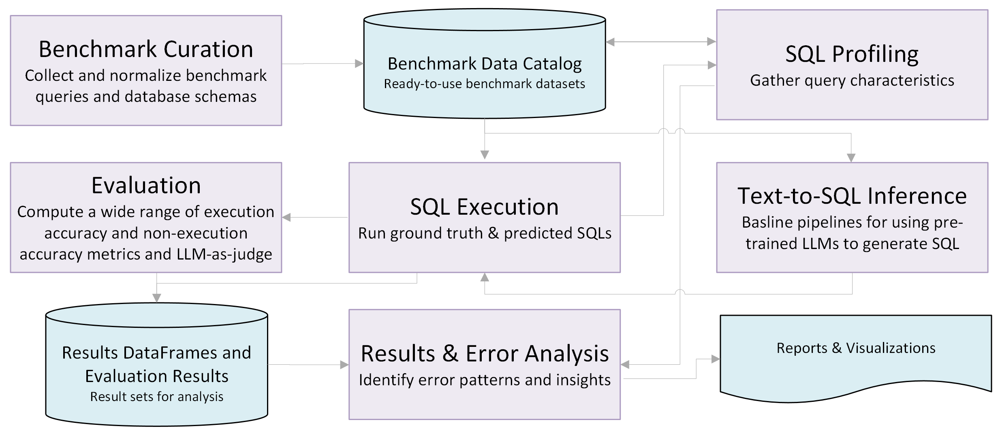

# Text-to-SQL Evaluation Toolkit

> **A modular framework for evaluating natural language to SQL systems**  
> Supports execution-based metrics, multiple ground truths, LLM-as-judge, and rich error analysis.

Text-to-SQL systems aim to translate natural language questions into executable SQL queries, enabling intuitive access to structured data. While recent advances in large language models have significantly improved generation quality, evaluating these systems remains a complex and critical challenge.

*Why an Evaluation Toolkit?*

Assessing the correctness and utility of generated SQL queries requires more than simple string matching—it demands a flexible, rigorous framework that accounts for semantic equivalence, execution behavior, and real-world variability in query formulation. This toolkit was designed to address key limitations in existing approaches and provide a comprehensive solution for researchers and developers.

### Key Challenges in Evaluation

- **SQL Semantics Are Subtle**: Minor syntactic differences can lead to major semantic changes—or none at all. Traditional string-based metrics often fail to capture this nuance.
- **Execution-Based Validation Is Inconsistent**: Existing implementations often expect exact column sets, even when the question allows flexibility. For example, a query asking for a list of customers might return IDs, names, or both—all valid answers, yet not always recognized as such.
- **Lack of Unified Standards**: There is no widely adopted, unified implementation for execution-based evaluation, leading to fragmented and sometimes misleading results.
- **Multiple Valid SQLs**: Many questions have more than one correct SQL formulation. This toolkit supports multiple ground truth queries to reflect that reality.
- **LLM-as-Judge Support**: In cases where ground truth is unavailable or traditional metrics fall short, the toolkit enables using LLMs as judges—a surprisingly reliable method for assessing query correctness and relevance.
- **Error Analysis and Visualization**: Understanding *why* a model fails is just as important as knowing *that* it fails. The toolkit includes scripts and notebooks for summarizing results, visualizing performance, and performing detailed error analysis.

### What This Toolkit Offers

- Modular components for inference, execution, evaluation, profiling, and analysis
- Support for multiple benchmarks and flexible configurations
- Extensible metrics and evaluation strategies
- Tools for debugging and improving model performance
- A practical framework for both academic research and production-level benchmarking

Whether you're building new models, comparing existing ones, or diagnosing performance bottlenecks, this toolkit provides the resources needed to evaluate text-to-SQL systems with rigor and clarity.

## Components

<p align="center">
  
</p>

- **Evaluation** ([`scripts/evaluation`](scripts/evaluation)/`src/evaluation.py`): Includes a script and library for evaluating text-to-SQL model outputs using various metrics. See [`scripts/evaluation/README.md`](scripts/evaluation/README.md) for details.
- **Text-to-SQL Inference** ([`scripts/inference`](scripts/inference)): Provides a simple LLM inference pipeline for generating SQL queries from natural language inputs. Run `python scripts/inference/run_inference.py -h` for more information.
- **SQL Execution** ([`scripts/execution`](scripts/execution)): Runs the ground truth and predicted SQLs for a given benchmark and saves the dataframes for evaluation and error analysis. Run `python scripts/execution/run_execution.py -h` for more information.
- **Results and Error Analysis** ([`scripts/analysis`](`scripts/analysis`)): Contains scripts and utilities for analyzing evaluation results, identifying common error patterns, and generating summary statistics and visualizations. Useful for debugging and improving model performance.
- **SQL Profiling** ([`scripts/profiling`](`scripts/profiling`)) tools to profile SQL queries to gather query characteristics to facilitate better analysis of results and errors.

## Setup

### Prerequisites

- Python 3.11 or higher
- [UV](https://github.com/astral-sh/uv) package manager (recommended) or pip/conda

### Installing UV (Recommended)

UV is a fast Python package manager that makes setup much quicker:

```bash
# macOS/Linux
curl -LsSf https://astral.sh/uv/install.sh | sh

# Or using pip
pip install uv

# Or using Homebrew (macOS)
brew install uv
```

## Installation

### Option 1: Using UV (Recommended - Fast! ⚡)

```bash
# Clone the repository
git clone https://github.com/IBM/text2sql-eval-toolkit.git
cd text2sql-eval-toolkit

# Create virtual environment and install dependencies
uv venv
source .venv/bin/activate  # On Windows: .venv\Scripts\activate

# Install the package in editable mode
uv pip install -e .

# Optional: Install with database-specific dependencies
uv pip install -e ".[mysql,presto,db2]"
```

### Option 2: Using pip/conda (Traditional)

```bash
# Create conda environment (or use venv)
conda create -n evaltoolkit python=3.12
conda activate evaltoolkit

# Clone and install
git clone https://github.com/IBM/text2sql-eval-toolkit.git
cd text2sql-eval-toolkit
pip install -e .
```

## Additional Requirements

To use features that rely on LLM inference, you need to set the required environment variables for the relevant services. For watsonx.ai, this includes setting the following environment variables: `WATSONX_APIKEY`, `WATSONX_API_BASE`, and `WATSONX_PROJECTID`. See [env.example](env.example) for all available configuration options.

### Benchmarks

The toolkit comes with pre-defined public benchmarks including BIRD-SQL, Spider, Beaver, and Archer. These benchmarks require initial setup such as downloading databases or configuring connection strings. The toolkit also includes smaller test benchmarks (subsets of the full benchmarks) for quick validation and CI/CD pipelines.

**📚 See [data/benchmarks/README.md](data/benchmarks/README.md) for complete benchmark details, setup instructions, and configuration.**

## Usage

### Running Experiments

**Single Benchmark:**
```bash
python scripts/run_experiment.py [benchmark_name]
```

This will initialize a pipeline, perform inference to generate SQLs and output dataframes, and run the evaluation script to gather accuracy metrics. Benchmark names and configurations are defined in [`data/benchmarks.json`](data/benchmarks.json) (for full benchmarks) or [`data/test-benchmarks.json`](data/test-benchmarks.json) (for test benchmarks). See [data/benchmarks/README.md](data/benchmarks/README.md) for more details. Run `python scripts/run_experiment.py -h` for details on how to set different input arguments for the script.

**Multiple Benchmarks:**
```bash
# Run all test benchmarks (recommended for quick validation)
python scripts/run_all_benchmarks.py --test

# Run all full benchmarks
python scripts/run_all_benchmarks.py

# Run with all baselines (standard + 6 agentic variants)
python scripts/run_all_benchmarks.py --test --run_all_baselines
```

The `run_all_benchmarks.py` script supports separate model configurations for standard and agentic baselines to optimize runtime. See [data/benchmarks/README.md](data/benchmarks/README.md#model-configuration) for detailed configuration options.

### Running Individual Components

To run evaluation only:

```
python scripts/evaluation/run_evaluation.py [-h] [--output_file OUTPUT_FILE] [--summary_file SUMMARY_FILE] [--csv_summary_file CSV_SUMMARY_FILE] [--use_llm_judge] input_file
```

See [`scripts/evaluation/README.md`](scripts/evaluation/README.md) for details.

To run inference only:

```bash
# Standard baseline inference
python scripts/inference/run_inference.py benchmark_id [--model_names MODEL1 MODEL2 ...]

# Agentic pipeline inference with default models
python scripts/inference/run_inference.py benchmark_id --pipeline_type agentic

# Agentic pipeline with custom models
python scripts/inference/run_inference.py benchmark_id --pipeline_type agentic \
  --agentic_models "wxai:openai/gpt-oss-120b" "wxai:meta-llama/llama-3-3-70b-instruct"

# Additional options
python scripts/inference/run_inference.py benchmark_id \
  --pipeline_type agentic \
  --agentic_version v2 \
  --max_attempts 5 \
  --max_new_tokens 1024
```

Like `run_experiment.py` and `run_all_benchmarks.py`, the inference script supports separate model configurations via `--model_names` (for standard baseline) and `--agentic_models` (for agentic pipeline). Run `python scripts/inference/run_inference.py -h` for all options.

To run execution only:

```
python scripts/execution/run_execution.py [-h] benchmark_id
```

To produce the results dashboard along with results summary and error analysis Markdown files for all the benchmarks defined in the `data/benchmarks.json` file, run:

```
python scripts/analysis/make_summary_report.py
```

The output will be written to [data/results/README.md](data/results/README.md).

## Project Structure

```
text2sql-eval-toolkit
├── notebooks/                  # Jupyter notebooks showcasing the use of the toolkit functions
├── data/                       # Benchmark datasets and evaluation results
│   ├── benchmarks/             # Benchmark data and schema files
│   │   ├── README.md           # Detailed benchmark documentation
│   │   ├── test_benchmarks/    # Test benchmark data files
│   │   └── dbs/                # Database files and setup instructions
│   ├── benchmarks.json         # Full benchmarks configuration
│   ├── test-benchmarks.json    # Test benchmarks configuration (smaller datasets)
│   └── results/                # Evaluation outputs
│           └── README.md       # Summary of results
├── scripts/                    # Scripts for running experiments
│   ├── analysis/               # Results and error analysis scripts and utilities
│   ├── curation/               # Benchmark data curation and preprocessing scripts
│   ├── evaluation/             # Evaluation pipeline script
│   ├── execution/              # Scripts for SQL execution
│   ├── inference/              # Inference pipeline (baseline) script
│   ├── profiling/              # SQL query profiling script
├── src/                        # Source code for the toolkit
│   └── text2sql_eval_toolkit/  # Core modules
│       ├── analysis/           # Results and error analysis module
│       ├── evaluation/         # Evaluation module
│       ├── execution/          # SQL execution module
│       ├── inference/          # LLM inference (baseline) module
│       └── profiling/          # SQL profiling module
├── pyproject.toml              # Build system and project metadata
├── README.md                   # Project documentation
├── requirements.txt            # Python dependencies
└── LICENSE                     # License file

```

## Contributing

We welcome external contributions! If you have an itch, please feel free to scratch it.

To contribute code or documentation, please submit a [pull request](https://github.com/IBM/text2sql-eval-toolkit/pulls).

A good way to familiarize yourself with the codebase and contribution process is to look for and tackle low-hanging fruit in the [issue tracker](https://github.com/IBM/text2sql-eval-toolkit/issues).

**Note: We appreciate your effort, and want to avoid a situation where a contribution requires extensive rework (by you or by us), sits in backlog for a long time, or cannot be accepted at all!**

For detailed contribution guidelines, please see [CONTRIBUTING.md](CONTRIBUTING.md).

### Pull Request Process

1. Fork the repo
2. Create your feature branch (`git checkout -b my-new-feature`)
3. Commit your changes (`git commit -am 'Added some feature'`)
4. Push to the branch (`git push origin my-new-feature`)
5. Create new Pull Request

## License

This project is licensed under the Apache License 2.0. See the [LICENSE](LICENSE) file for more details.

## Additional Resources

- [CODE_OF_CONDUCT.md](CODE_OF_CONDUCT.md) - Community guidelines
- [SECURITY.md](SECURITY.md) - Security policy and vulnerability reporting
- [MAINTAINERS.md](MAINTAINERS.md) - Project maintainers
- [CHANGELOG.md](CHANGELOG.md) - Project changelog

[issues]: https://github.com/IBM/text2sql-eval-toolkit/issues/new
