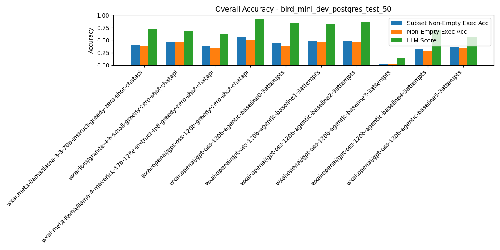
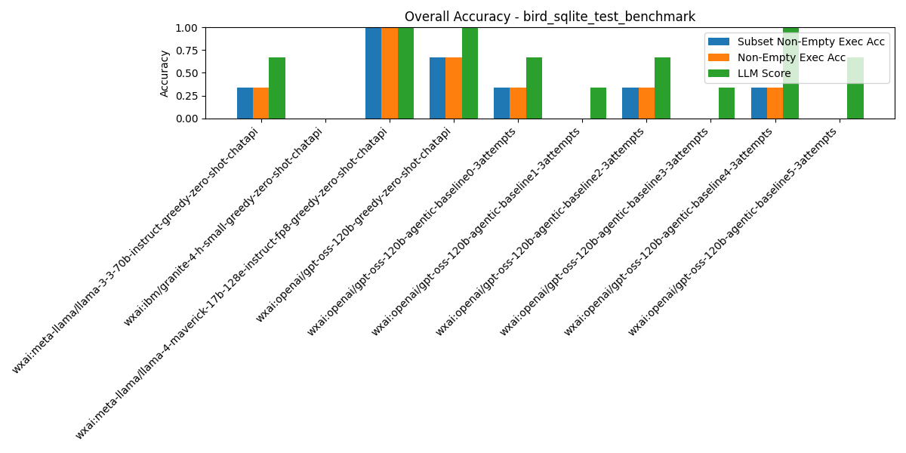

# Text-to-SQL Evaluation Results Dashboard

| Benchmark | Description | DB Type | Records | Pipelines |
|-----------|-------------|---------|---------|-----------|
| [bird_mini_dev_sqlite_test_50](#benchmark-bird_mini_dev_sqlite_test_50) | Test sample of 50 BIRD-SQL Mini-Dev in SQLite https://github.com/bird-bench/mini_dev | sqlite | 50 | 10 |
| [bird_mini_dev_postgres_test_50](#benchmark-bird_mini_dev_postgres_test_50) | Test sample of 50 BIRD-SQL Mini-Dev in PostgreSQL https://github.com/bird-bench/mini_dev | postgres | 50 | 10 |
| [spider_dev_test_50](#benchmark-spider_dev_test_50) | Test sample of 50 Spider Dev questions https://yale-lily.github.io/spider | sqlite | 50 | 10 |
| [beaver_test_10](#benchmark-beaver_test_10) | Test sample of 10 Beaver benchmark questions https://peterbaile.github.io/beaver/ | mysql | 10 | 10 |
| [archer_en_dev_test_10](#benchmark-archer_en_dev_test_10) | Test sample of 10 Archer English Dev questions https://sig4kg.github.io/archer-bench/ | sqlite | 10 | 10 |
| [bird_sqlite_test_benchmark](#benchmark-bird_sqlite_test_benchmark) | 3 records from BIRD mini-dev used for testing this code base | sqlite | 3 | 10 |

---
### Benchmark: bird_mini_dev_sqlite_test_50

_Results sorted by default on `subset_non_empty_execution_accuracy` (higher is better)_

📄 [View In-Depth Summary Results Across Categories](bird_mini_dev_sqlite_test_50-predictions_eval_summary.md) - [View Examples of Errors for Error Analysis](bird_mini_dev_sqlite_test_50-predictions_eval_errors.md) - [View Full Results JSON](bird_mini_dev_sqlite_test_50-predictions_eval.json)

| Rank | Model / Pipeline | Execution Acc | Non-Empty Exec Acc | Subset Non-Empty Exec Acc | BIRD Exec Acc | LLM Judge Score | Parsable SQL | SQL Syntactic Match | Eval Err | DF Err | Avg Tokens/Q | Avg Inference (ms) | Avg Execution (ms) | Total Tokens | Total Inference (ms) | Total Execution (ms) | #Records | #Predictions | #Evaluated | #Correct Non-Empty Exec Acc | #Correct Subset Non-Empty Exec Acc | #Correct As Per LLM Judge |
| --- | --- | --- | --- | --- | --- | --- | --- | --- | --- | --- | --- | --- | --- | --- | --- | --- | --- | --- | --- | --- | --- | --- |
| 1 | wxai:meta-llama/llama-4-maverick-17b-128e-instruct-fp8-greedy-zero-shot-chatapi | 0.62 | 0.62 | 0.66 | 0.64 | 0.92 | 1.00 | 0.22 | 0.00 | 0.02 | 1607.30 | 2229.43 | 50.11 | 80365 | 111471.25 | 2505.46 | 50 | 50 | 50 | 31 | 33 | 46 |
| 2 | wxai:meta-llama/llama-3-3-70b-instruct-greedy-zero-shot-chatapi | 0.62 | 0.62 | 0.64 | 0.66 | 0.96 | 1.00 | 0.24 | 0.00 | 0.02 | 1622.52 | 4774.58 | 45.90 | 81126 | 238729.15 | 2295.07 | 50 | 50 | 50 | 31 | 32 | 48 |
| 3 | wxai:openai/gpt-oss-120b-greedy-zero-shot-chatapi | 0.56 | 0.56 | 0.60 | 0.58 | 0.94 | 1.00 | 0.08 | 0.00 | 0.04 | 1895.40 | 3800.23 | 31.12 | 94770 | 190011.67 | 1555.95 | 50 | 50 | 50 | 28 | 30 | 47 |
| 4 | wxai:ibm/granite-4-h-small-greedy-zero-shot-chatapi | 0.56 | 0.56 | 0.58 | 0.58 | 0.74 | 1.00 | 0.10 | 0.00 | 0.08 | 1602.42 | 3976.35 | 38.92 | 80121 | 198817.26 | 1945.93 | 50 | 50 | 50 | 28 | 29 | 37 |
| 5 | wxai:openai/gpt-oss-120b-agentic-baseline2-3attempts | 0.54 | 0.54 | 0.56 | 0.54 | 0.88 | 1.00 | 0.08 | 0.00 | 0.00 | 1972.14 | 4509.20 | N/A | 98607 | 225459.78 | N/A | 50 | 50 | 50 | 27 | 28 | 44 |
| 6 | wxai:openai/gpt-oss-120b-agentic-baseline1-3attempts | 0.54 | 0.54 | 0.54 | 0.58 | 0.88 | 1.00 | 0.08 | 0.00 | 0.02 | 2007.38 | 4038.14 | N/A | 100369 | 201906.78 | N/A | 50 | 50 | 50 | 27 | 27 | 44 |
| 7 | wxai:openai/gpt-oss-120b-agentic-baseline5-3attempts | 0.52 | 0.52 | 0.54 | 0.52 | 0.78 | 0.92 | 0.04 | 0.00 | 0.04 | 12902.58 | 132503.82 | N/A | 645129 | 6625191.01 | N/A | 50 | 50 | 46 | 26 | 27 | 39 |
| 8 | wxai:openai/gpt-oss-120b-agentic-baseline0-3attempts | 0.40 | 0.40 | 0.50 | 0.40 | 0.88 | 1.00 | 0.06 | 0.00 | 0.02 | 2381.54 | 5256.72 | N/A | 119077 | 262836.03 | N/A | 50 | 50 | 50 | 20 | 25 | 44 |
| 9 | wxai:openai/gpt-oss-120b-agentic-baseline4-3attempts | 0.46 | 0.46 | 0.50 | 0.46 | 0.86 | 0.92 | 0.06 | 0.00 | 0.02 | 4713.96 | 71631.53 | N/A | 235698 | 3581576.55 | N/A | 50 | 50 | 46 | 23 | 25 | 43 |
| 10 | wxai:openai/gpt-oss-120b-agentic-baseline3-3attempts | 0.00 | 0.00 | 0.02 | 0.00 | 0.06 | 1.00 | 0.06 | 0.00 | 0.90 | 5994.34 | 34748.81 | N/A | 299717 | 1737440.72 | N/A | 50 | 50 | 50 | 0 | 1 | 3 |

### Benchmark: bird_mini_dev_postgres_test_50

_Results sorted by default on `subset_non_empty_execution_accuracy` (higher is better)_

📄 [View In-Depth Summary Results Across Categories](bird_mini_dev_postgres_test_50-predictions_eval_summary.md) - [View Examples of Errors for Error Analysis](bird_mini_dev_postgres_test_50-predictions_eval_errors.md) - [View Full Results JSON](bird_mini_dev_postgres_test_50-predictions_eval.json)

| Rank | Model / Pipeline | Execution Acc | Non-Empty Exec Acc | Subset Non-Empty Exec Acc | BIRD Exec Acc | LLM Judge Score | Parsable SQL | SQL Syntactic Match | Eval Err | DF Err | Avg Tokens/Q | Avg Inference (ms) | Avg Execution (ms) | Total Tokens | Total Inference (ms) | Total Execution (ms) | #Records | #Predictions | #Evaluated | #Correct Non-Empty Exec Acc | #Correct Subset Non-Empty Exec Acc | #Correct As Per LLM Judge |
| --- | --- | --- | --- | --- | --- | --- | --- | --- | --- | --- | --- | --- | --- | --- | --- | --- | --- | --- | --- | --- | --- | --- |
| 1 | wxai:openai/gpt-oss-120b-greedy-zero-shot-chatapi | 0.50 | 0.50 | 0.56 | 0.50 | 0.92 | 1.00 | 0.04 | 0.00 | 0.04 | 1930.62 | 3961.66 | 265.43 | 96531 | 198082.87 | 13271.51 | 50 | 50 | 50 | 25 | 28 | 46 |
| 2 | wxai:openai/gpt-oss-120b-agentic-baseline1-3attempts | 0.46 | 0.46 | 0.48 | 0.46 | 0.82 | 1.00 | 0.04 | 0.00 | 0.02 | 2097.16 | 5149.69 | N/A | 104858 | 257484.67 | N/A | 50 | 50 | 50 | 23 | 24 | 41 |
| 3 | wxai:openai/gpt-oss-120b-agentic-baseline2-3attempts | 0.46 | 0.46 | 0.48 | 0.48 | 0.86 | 1.00 | 0.04 | 0.00 | 0.00 | 2071.52 | 5997.67 | N/A | 103576 | 299883.44 | N/A | 50 | 50 | 50 | 23 | 24 | 43 |
| 4 | wxai:ibm/granite-4-h-small-greedy-zero-shot-chatapi | 0.46 | 0.46 | 0.46 | 0.48 | 0.68 | 1.00 | 0.10 | 0.00 | 0.20 | 1623.38 | 3341.61 | 279.72 | 81169 | 167080.6 | 13986.2 | 50 | 50 | 50 | 23 | 23 | 34 |
| 5 | wxai:openai/gpt-oss-120b-agentic-baseline0-3attempts | 0.38 | 0.38 | 0.44 | 0.38 | 0.84 | 1.00 | 0.02 | 0.00 | 0.04 | 2331.64 | 6018.70 | N/A | 116582 | 300935.2 | N/A | 50 | 50 | 50 | 19 | 22 | 42 |
| 6 | wxai:meta-llama/llama-3-3-70b-instruct-greedy-zero-shot-chatapi | 0.38 | 0.38 | 0.40 | 0.38 | 0.72 | 1.00 | 0.08 | 0.00 | 0.22 | 1637.94 | 3654.99 | 237.45 | 81897 | 182749.28 | 11872.44 | 50 | 50 | 50 | 19 | 20 | 36 |
| 7 | wxai:meta-llama/llama-4-maverick-17b-128e-instruct-fp8-greedy-zero-shot-chatapi | 0.34 | 0.34 | 0.38 | 0.34 | 0.62 | 1.00 | 0.14 | 0.00 | 0.30 | 1622.12 | 2303.68 | 226.71 | 81106 | 115184.01 | 11335.33 | 50 | 50 | 50 | 17 | 19 | 31 |
| 8 | wxai:openai/gpt-oss-120b-agentic-baseline5-3attempts | 0.34 | 0.34 | 0.36 | 0.34 | 0.56 | 0.80 | 0.04 | 0.00 | 0.16 | 15468.72 | 190607.74 | N/A | 773436 | 9530387.05 | N/A | 50 | 50 | 40 | 17 | 18 | 28 |
| 9 | wxai:openai/gpt-oss-120b-agentic-baseline4-3attempts | 0.28 | 0.28 | 0.32 | 0.28 | 0.70 | 0.78 | 0.04 | 0.00 | 0.16 | 4559.68 | 81325.60 | N/A | 227984 | 4066279.76 | N/A | 50 | 42 | 47 | 14 | 16 | 35 |
| 10 | wxai:openai/gpt-oss-120b-agentic-baseline3-3attempts | 0.02 | 0.02 | 0.02 | 0.02 | 0.14 | 1.00 | 0.02 | 0.00 | 0.84 | 6262.92 | 38733.48 | N/A | 313146 | 1936673.77 | N/A | 50 | 50 | 50 | 1 | 1 | 7 |

### Benchmark: spider_dev_test_50

_Results sorted by default on `subset_non_empty_execution_accuracy` (higher is better)_

📄 [View In-Depth Summary Results Across Categories](spider_dev_test_50-predictions_eval_summary.md) - [View Examples of Errors for Error Analysis](spider_dev_test_50-predictions_eval_errors.md) - [View Full Results JSON](spider_dev_test_50-predictions_eval.json)

| Rank | Model / Pipeline | Execution Acc | Non-Empty Exec Acc | Subset Non-Empty Exec Acc | BIRD Exec Acc | LLM Judge Score | Parsable SQL | SQL Syntactic Match | Eval Err | DF Err | Avg Tokens/Q | Avg Inference (ms) | Avg Execution (ms) | Total Tokens | Total Inference (ms) | Total Execution (ms) | #Records | #Predictions | #Evaluated | #Correct Non-Empty Exec Acc | #Correct Subset Non-Empty Exec Acc | #Correct As Per LLM Judge |
| --- | --- | --- | --- | --- | --- | --- | --- | --- | --- | --- | --- | --- | --- | --- | --- | --- | --- | --- | --- | --- | --- | --- |
| 1 | wxai:meta-llama/llama-3-3-70b-instruct-greedy-zero-shot-chatapi | 0.84 | 0.82 | 0.84 | 0.86 | 1.00 | 1.00 | 0.24 | 0.00 | 0.00 | 1043.98 | 2413.82 | 32.03 | 52199 | 120690.89 | 1601.69 | 50 | 50 | 50 | 41 | 42 | 50 |
| 2 | wxai:openai/gpt-oss-120b-agentic-baseline2-3attempts | 0.84 | 0.84 | 0.84 | 0.86 | 1.00 | 1.00 | 0.32 | 0.00 | 0.00 | 1211.80 | 2428.88 | N/A | 60590 | 121444.22 | N/A | 50 | 50 | 50 | 42 | 42 | 50 |
| 3 | wxai:openai/gpt-oss-120b-greedy-zero-shot-chatapi | 0.82 | 0.82 | 0.82 | 0.84 | 0.98 | 1.00 | 0.34 | 0.00 | 0.02 | 1230.72 | 2662.51 | 28.69 | 61536 | 133125.42 | 1434.65 | 50 | 50 | 50 | 41 | 41 | 49 |
| 4 | wxai:meta-llama/llama-4-maverick-17b-128e-instruct-fp8-greedy-zero-shot-chatapi | 0.82 | 0.80 | 0.80 | 0.84 | 1.00 | 1.00 | 0.22 | 0.00 | 0.00 | 1026.86 | 1198.92 | 31.38 | 51343 | 59945.85 | 1568.98 | 50 | 50 | 50 | 40 | 40 | 50 |
| 5 | wxai:openai/gpt-oss-120b-agentic-baseline0-3attempts | 0.76 | 0.76 | 0.80 | 0.76 | 1.00 | 1.00 | 0.26 | 0.00 | 0.00 | 1298.20 | 2946.97 | N/A | 64910 | 147348.39 | N/A | 50 | 50 | 50 | 38 | 40 | 50 |
| 6 | wxai:openai/gpt-oss-120b-agentic-baseline1-3attempts | 0.78 | 0.78 | 0.80 | 0.80 | 1.00 | 1.00 | 0.34 | 0.00 | 0.00 | 1222.84 | 2378.45 | N/A | 61142 | 118922.31 | N/A | 50 | 50 | 50 | 39 | 40 | 50 |
| 7 | wxai:openai/gpt-oss-120b-agentic-baseline4-3attempts | 0.74 | 0.74 | 0.80 | 0.74 | 1.00 | 1.00 | 0.32 | 0.00 | 0.00 | 3600.64 | 70773.97 | N/A | 180032 | 3538698.42 | N/A | 50 | 50 | 50 | 37 | 40 | 50 |
| 8 | wxai:ibm/granite-4-h-small-greedy-zero-shot-chatapi | 0.78 | 0.76 | 0.78 | 0.84 | 0.98 | 1.00 | 0.32 | 0.00 | 0.00 | 1021.50 | 3637.88 | 33.12 | 51075 | 181894.07 | 1655.83 | 50 | 50 | 50 | 38 | 39 | 49 |
| 9 | wxai:openai/gpt-oss-120b-agentic-baseline5-3attempts | 0.72 | 0.72 | 0.72 | 0.72 | 0.88 | 0.96 | 0.30 | 0.00 | 0.04 | 9067.90 | 97186.35 | N/A | 453395 | 4859317.49 | N/A | 50 | 50 | 48 | 36 | 36 | 44 |
| 10 | wxai:openai/gpt-oss-120b-agentic-baseline3-3attempts | 0.04 | 0.04 | 0.04 | 0.04 | 0.06 | 1.00 | 0.28 | 0.00 | 0.92 | 4158.52 | 26519.79 | N/A | 207926 | 1325989.26 | N/A | 50 | 50 | 50 | 2 | 2 | 3 |

### Benchmark: beaver_test_10

_Results sorted by default on `subset_non_empty_execution_accuracy` (higher is better)_

📄 [View In-Depth Summary Results Across Categories](beaver_test_10-predictions_eval_summary.md) - [View Examples of Errors for Error Analysis](beaver_test_10-predictions_eval_errors.md) - [View Full Results JSON](beaver_test_10-predictions_eval.json)

| Rank | Model / Pipeline | Execution Acc | Non-Empty Exec Acc | Subset Non-Empty Exec Acc | BIRD Exec Acc | LLM Judge Score | Parsable SQL | SQL Syntactic Match | Eval Err | DF Err | Avg Tokens/Q | Avg Inference (ms) | Avg Execution (ms) | Total Tokens | Total Inference (ms) | Total Execution (ms) | #Records | #Predictions | #Evaluated | #Correct Non-Empty Exec Acc | #Correct Subset Non-Empty Exec Acc | #Correct As Per LLM Judge |
| --- | --- | --- | --- | --- | --- | --- | --- | --- | --- | --- | --- | --- | --- | --- | --- | --- | --- | --- | --- | --- | --- | --- |
| 1 | wxai:meta-llama/llama-3-3-70b-instruct-greedy-zero-shot-chatapi | 0.00 | 0.00 | 0.10 | 0.00 | 0.20 | 1.00 | 0.00 | 0.00 | 0.70 | 48893.10 | 28217.68 | 303.90 | 488931 | 282176.83 | 3039.0 | 10 | 10 | 10 | 0 | 1 | 2 |
| 2 | wxai:ibm/granite-4-h-small-greedy-zero-shot-chatapi | 0.00 | 0.00 | 0.10 | 0.00 | 0.10 | 0.90 | 0.00 | 0.00 | 0.80 | 42371.10 | 15198.26 | 274.02 | 423711 | 151982.57 | 2740.19 | 10 | 9 | 10 | 0 | 1 | 1 |
| 3 | wxai:meta-llama/llama-4-maverick-17b-128e-instruct-fp8-greedy-zero-shot-chatapi | 0.00 | 0.00 | 0.10 | 0.00 | 0.20 | 1.00 | 0.00 | 0.00 | 0.70 | 48827.90 | 6961.10 | 418.78 | 488279 | 69611.01 | 4187.81 | 10 | 10 | 10 | 0 | 1 | 2 |
| 4 | wxai:openai/gpt-oss-120b-greedy-zero-shot-chatapi | 0.00 | 0.00 | 0.10 | 0.00 | 0.50 | 1.00 | 0.00 | 0.00 | 0.40 | 49433.50 | 11729.68 | 1107.51 | 494335 | 117296.75 | 11075.08 | 10 | 10 | 10 | 0 | 1 | 5 |
| 5 | wxai:openai/gpt-oss-120b-agentic-baseline0-3attempts | 0.00 | 0.00 | 0.10 | 0.00 | 0.50 | 0.80 | 0.00 | 0.00 | 0.30 | 101342.00 | 64047.33 | N/A | 1013420 | 640473.35 | N/A | 10 | 10 | 10 | 0 | 1 | 5 |
| 6 | wxai:openai/gpt-oss-120b-agentic-baseline1-3attempts | 0.00 | 0.00 | 0.10 | 0.00 | 0.80 | 1.00 | 0.10 | 0.00 | 0.10 | 71213.00 | 34144.94 | N/A | 712130 | 341449.45 | N/A | 10 | 10 | 10 | 0 | 1 | 8 |
| 7 | wxai:openai/gpt-oss-120b-agentic-baseline2-3attempts | 0.00 | 0.00 | 0.10 | 0.00 | 0.70 | 1.00 | 0.00 | 0.00 | 0.10 | 73767.40 | 25216.78 | N/A | 737674 | 252167.85 | N/A | 10 | 10 | 10 | 0 | 1 | 7 |
| 8 | wxai:openai/gpt-oss-120b-agentic-baseline5-3attempts | 0.00 | 0.00 | 0.10 | 0.00 | 0.20 | 0.20 | 0.00 | 0.00 | 0.00 | 35936.00 | 178808.32 | N/A | 359360 | 1788083.15 | N/A | 10 | 10 | 2 | 0 | 1 | 2 |
| 9 | wxai:openai/gpt-oss-120b-agentic-baseline3-3attempts | 0.00 | 0.00 | 0.00 | 0.00 | 0.40 | 1.00 | 0.10 | 0.00 | 0.40 | 109440.80 | 92155.06 | N/A | 1094408 | 921550.65 | N/A | 10 | 10 | 10 | 0 | 0 | 4 |
| 10 | wxai:openai/gpt-oss-120b-agentic-baseline4-3attempts | 0.00 | 0.00 | 0.00 | 0.00 | 0.20 | 0.40 | 0.00 | 0.00 | 0.20 | 87759.30 | 142662.67 | N/A | 877593 | 1426626.67 | N/A | 10 | 10 | 4 | 0 | 0 | 2 |

### Benchmark: archer_en_dev_test_10

_Results sorted by default on `subset_non_empty_execution_accuracy` (higher is better)_

📄 [View In-Depth Summary Results Across Categories](archer_en_dev_test_10-predictions_eval_summary.md) - [View Examples of Errors for Error Analysis](archer_en_dev_test_10-predictions_eval_errors.md) - [View Full Results JSON](archer_en_dev_test_10-predictions_eval.json)

| Rank | Model / Pipeline | Execution Acc | Non-Empty Exec Acc | Subset Non-Empty Exec Acc | BIRD Exec Acc | LLM Judge Score | Parsable SQL | SQL Syntactic Match | Eval Err | DF Err | Avg Tokens/Q | Avg Inference (ms) | Avg Execution (ms) | Total Tokens | Total Inference (ms) | Total Execution (ms) | #Records | #Predictions | #Evaluated | #Correct Non-Empty Exec Acc | #Correct Subset Non-Empty Exec Acc | #Correct As Per LLM Judge |
| --- | --- | --- | --- | --- | --- | --- | --- | --- | --- | --- | --- | --- | --- | --- | --- | --- | --- | --- | --- | --- | --- | --- |
| 1 | wxai:ibm/granite-4-h-small-greedy-zero-shot-chatapi | 0.30 | 0.30 | 0.30 | 0.30 | 0.50 | 1.00 | 0.00 | 0.00 | 0.20 | 1046.50 | 3458.89 | 7.58 | 10465 | 34588.89 | 75.8 | 10 | 10 | 10 | 3 | 3 | 5 |
| 2 | wxai:meta-llama/llama-4-maverick-17b-128e-instruct-fp8-greedy-zero-shot-chatapi | 0.40 | 0.30 | 0.30 | 0.40 | 0.60 | 1.00 | 0.00 | 0.00 | 0.00 | 1169.40 | 3212.35 | 9.10 | 11694 | 32123.47 | 91.0 | 10 | 10 | 10 | 3 | 3 | 6 |
| 3 | wxai:openai/gpt-oss-120b-greedy-zero-shot-chatapi | 0.40 | 0.30 | 0.30 | 0.40 | 0.80 | 1.00 | 0.00 | 0.00 | 0.00 | 1623.50 | 3595.94 | 9.47 | 16235 | 35959.38 | 94.7 | 10 | 10 | 10 | 3 | 3 | 8 |
| 4 | wxai:openai/gpt-oss-120b-agentic-baseline0-3attempts | 0.30 | 0.30 | 0.30 | 0.30 | 0.50 | 1.00 | 0.00 | 0.00 | 0.00 | 1901.70 | 4453.97 | N/A | 19017 | 44539.67 | N/A | 10 | 10 | 10 | 3 | 3 | 5 |
| 5 | wxai:openai/gpt-oss-120b-agentic-baseline1-3attempts | 0.20 | 0.20 | 0.20 | 0.20 | 0.60 | 1.00 | 0.00 | 0.00 | 0.00 | 1918.90 | 4791.48 | N/A | 19189 | 47914.83 | N/A | 10 | 10 | 10 | 2 | 2 | 6 |
| 6 | wxai:openai/gpt-oss-120b-agentic-baseline2-3attempts | 0.30 | 0.20 | 0.20 | 0.30 | 0.60 | 1.00 | 0.00 | 0.00 | 0.00 | 2210.20 | 6226.44 | N/A | 22102 | 62264.38 | N/A | 10 | 10 | 10 | 2 | 2 | 6 |
| 7 | wxai:openai/gpt-oss-120b-agentic-baseline4-3attempts | 0.20 | 0.20 | 0.20 | 0.20 | 0.40 | 0.50 | 0.00 | 0.00 | 0.00 | 2099.80 | 18608.42 | N/A | 20998 | 186084.17 | N/A | 10 | 10 | 5 | 2 | 2 | 4 |
| 8 | wxai:meta-llama/llama-3-3-70b-instruct-greedy-zero-shot-chatapi | 0.20 | 0.10 | 0.10 | 0.20 | 0.70 | 1.00 | 0.00 | 0.00 | 0.10 | 1103.10 | 5109.29 | 8.68 | 11031 | 51092.9 | 86.84 | 10 | 10 | 10 | 1 | 1 | 7 |
| 9 | wxai:openai/gpt-oss-120b-agentic-baseline5-3attempts | 0.10 | 0.10 | 0.10 | 0.10 | 0.40 | 0.70 | 0.00 | 0.00 | 0.10 | 8215.40 | 45174.24 | N/A | 82154 | 451742.41 | N/A | 10 | 10 | 7 | 1 | 1 | 4 |
| 10 | wxai:openai/gpt-oss-120b-agentic-baseline3-3attempts | 0.00 | 0.00 | 0.00 | 0.00 | 0.20 | 1.00 | 0.00 | 0.00 | 0.70 | 4737.10 | 26210.07 | N/A | 47371 | 262100.68 | N/A | 10 | 10 | 10 | 0 | 0 | 2 |

### Benchmark: bird_sqlite_test_benchmark

_Results sorted by default on `subset_non_empty_execution_accuracy` (higher is better)_

📄 [View In-Depth Summary Results Across Categories](bird_sqlite_test_benchmark-predictions_eval_summary.md) - [View Examples of Errors for Error Analysis](bird_sqlite_test_benchmark-predictions_eval_errors.md) - [View Full Results JSON](bird_sqlite_test_benchmark-predictions_eval.json)

| Rank | Model / Pipeline | Execution Acc | Non-Empty Exec Acc | Subset Non-Empty Exec Acc | BIRD Exec Acc | LLM Judge Score | Parsable SQL | SQL Syntactic Match | Eval Err | DF Err | Avg Tokens/Q | Avg Inference (ms) | Avg Execution (ms) | Total Tokens | Total Inference (ms) | Total Execution (ms) | #Records | #Predictions | #Evaluated | #Correct Non-Empty Exec Acc | #Correct Subset Non-Empty Exec Acc | #Correct As Per LLM Judge |
| --- | --- | --- | --- | --- | --- | --- | --- | --- | --- | --- | --- | --- | --- | --- | --- | --- | --- | --- | --- | --- | --- | --- |
| 1 | wxai:meta-llama/llama-4-maverick-17b-128e-instruct-fp8-greedy-zero-shot-chatapi | 1.00 | 1.00 | 1.00 | 1.00 | 1.00 | 1.00 | 0.00 | 0.00 | 0.00 | 3533.00 | 1245.33 | 4.34 | 10599 | 3735.98 | 13.02 | 3 | 3 | 3 | 3 | 3 | 3 |
| 2 | wxai:openai/gpt-oss-120b-greedy-zero-shot-chatapi | 0.67 | 0.67 | 0.67 | 0.67 | 1.00 | 1.00 | 0.00 | 0.00 | 0.00 | 3943.67 | 3509.96 | 4.83 | 11831 | 10529.88 | 14.48 | 3 | 3 | 3 | 2 | 2 | 3 |
| 3 | wxai:meta-llama/llama-3-3-70b-instruct-greedy-zero-shot-chatapi | 0.33 | 0.33 | 0.33 | 0.33 | 0.67 | 1.00 | 0.00 | 0.00 | 0.33 | 3572.67 | 3229.73 | 1.65 | 10718 | 9689.18 | 4.95 | 3 | 3 | 3 | 1 | 1 | 2 |
| 4 | wxai:openai/gpt-oss-120b-agentic-baseline0-3attempts | 0.33 | 0.33 | 0.33 | 0.33 | 0.67 | 1.00 | 0.00 | 0.00 | 0.00 | 3993.33 | 4125.30 | N/A | 11980 | 12375.89 | N/A | 3 | 3 | 3 | 1 | 1 | 2 |
| 5 | wxai:openai/gpt-oss-120b-agentic-baseline2-3attempts | 0.33 | 0.33 | 0.33 | 0.33 | 0.67 | 1.00 | 0.00 | 0.00 | 0.00 | 6739.00 | 6792.60 | N/A | 20217 | 20377.81 | N/A | 3 | 3 | 3 | 1 | 1 | 2 |
| 6 | wxai:openai/gpt-oss-120b-agentic-baseline4-3attempts | 0.33 | 0.33 | 0.33 | 0.33 | 1.00 | 1.00 | 0.00 | 0.00 | 0.00 | 10066.67 | 20950.96 | N/A | 30200 | 62852.88 | N/A | 3 | 3 | 3 | 1 | 1 | 3 |
| 7 | wxai:ibm/granite-4-h-small-greedy-zero-shot-chatapi | 0.00 | 0.00 | 0.00 | 0.00 | 0.00 | 1.00 | 0.00 | 0.00 | 1.00 | 3588.00 | 3211.44 | N/A | 10764 | 9634.33 | N/A | 3 | 3 | 3 | 0 | 0 | 0 |
| 8 | wxai:openai/gpt-oss-120b-agentic-baseline1-3attempts | 0.00 | 0.00 | 0.00 | 0.00 | 0.33 | 1.00 | 0.00 | 0.00 | 0.33 | 6576.67 | 5909.69 | N/A | 19730 | 17729.07 | N/A | 3 | 3 | 3 | 0 | 0 | 1 |
| 9 | wxai:openai/gpt-oss-120b-agentic-baseline3-3attempts | 0.00 | 0.00 | 0.00 | 0.00 | 0.33 | 1.00 | 0.00 | 0.00 | 0.67 | 11353.67 | 26455.31 | N/A | 34061 | 79365.94 | N/A | 3 | 3 | 3 | 0 | 0 | 1 |
| 10 | wxai:openai/gpt-oss-120b-agentic-baseline5-3attempts | 0.00 | 0.00 | 0.00 | 0.00 | 0.67 | 0.67 | 0.00 | 0.00 | 0.00 | 12574.00 | 18079.01 | N/A | 37722 | 54237.04 | N/A | 3 | 3 | 2 | 0 | 0 | 2 |

