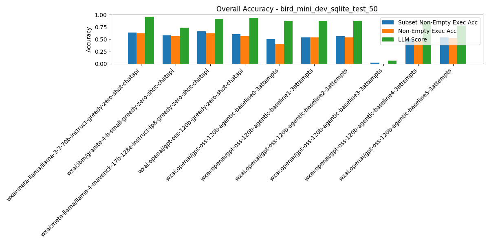
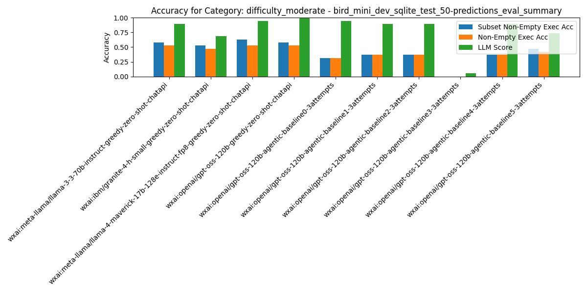
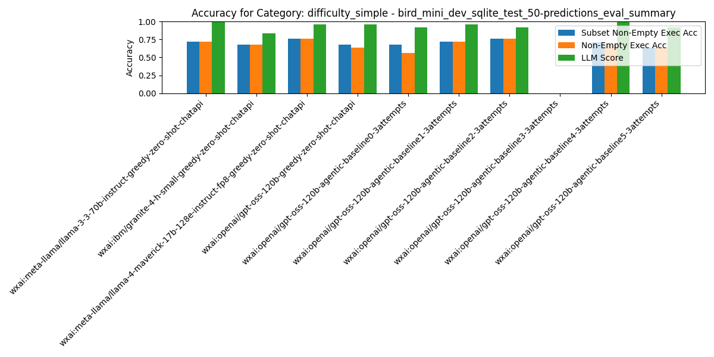
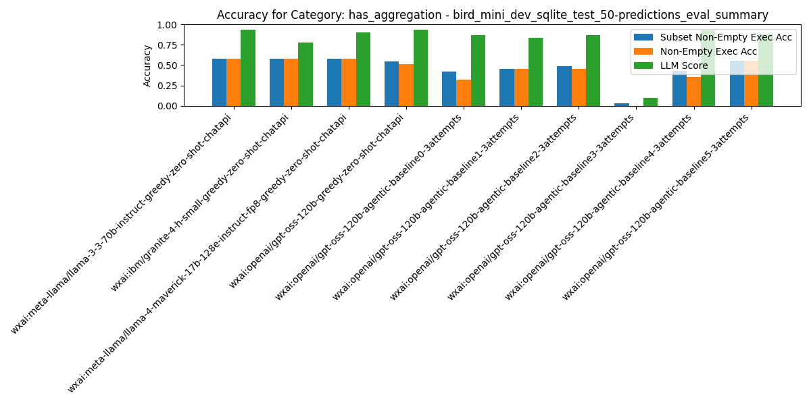
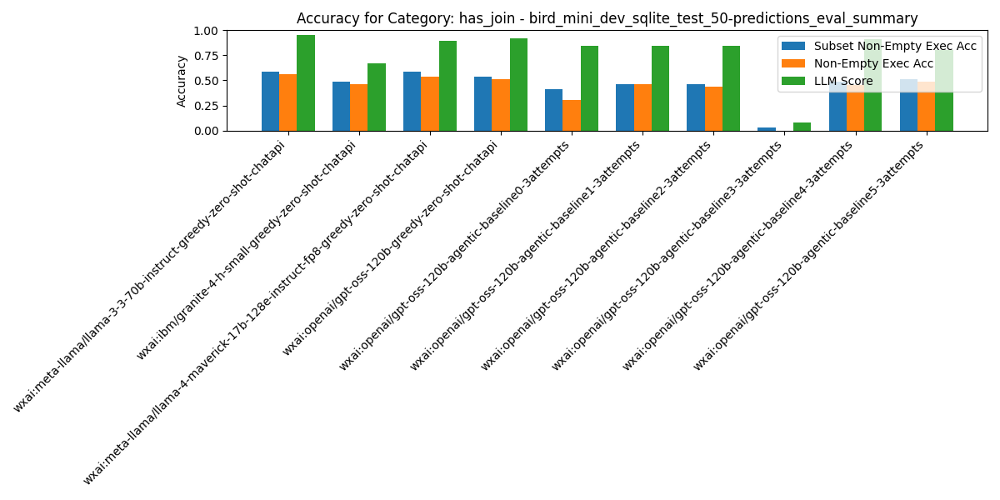
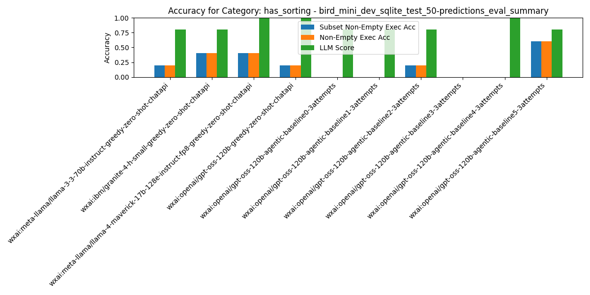
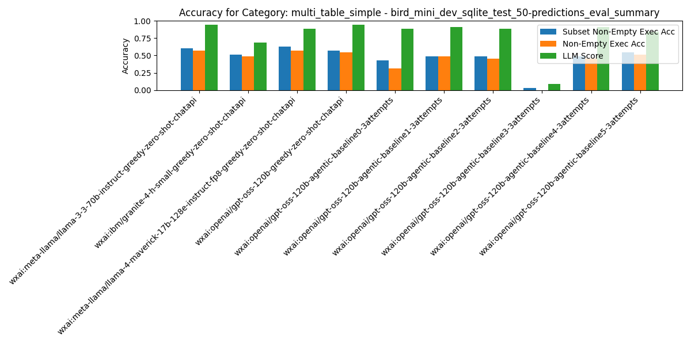
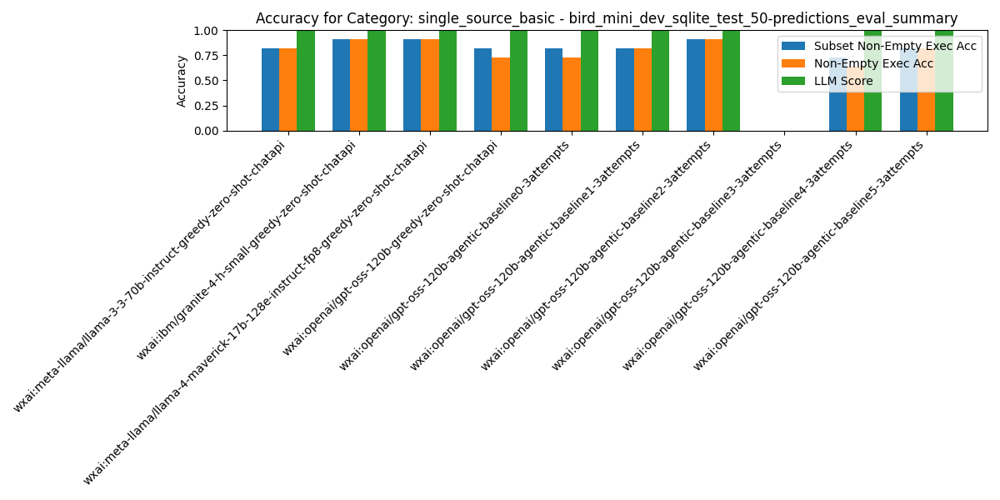

# Summary Results

## Overall Average Accuracy Results

| Rank | Pipeline | Records # | Predictions # | Exec Acc | Non-Empty Exec Acc | Subset Non-Empty Exec Acc | BIRD Exec Acc | Parsable SQL | Syntactic Equivalence Score | LLM Score |
| --- | --- | --- | --- | --- | --- | --- | --- | --- | --- | --- |
| 1 | wxai:meta-llama/llama-4-maverick-17b-128e-instruct-fp8-greedy-zero-shot-chatapi | 50 | 0 | 0.62 | 0.62 | 0.66 | 0.64 | 1.00 | 0.22 | 0.92 |
| 2 | wxai:meta-llama/llama-3-3-70b-instruct-greedy-zero-shot-chatapi | 50 | 0 | 0.62 | 0.62 | 0.64 | 0.66 | 1.00 | 0.24 | 0.96 |
| 3 | wxai:openai/gpt-oss-120b-greedy-zero-shot-chatapi | 50 | 0 | 0.56 | 0.56 | 0.60 | 0.58 | 1.00 | 0.08 | 0.94 |
| 4 | wxai:openai/gpt-oss-120b-agentic-baseline5-3attempts | 50 | 0 | 0.57 | 0.57 | 0.59 | 0.57 | 1.00 | 0.04 | 0.85 |
| 5 | wxai:ibm/granite-4-h-small-greedy-zero-shot-chatapi | 50 | 0 | 0.56 | 0.56 | 0.58 | 0.58 | 1.00 | 0.10 | 0.74 |
| 6 | wxai:openai/gpt-oss-120b-agentic-baseline2-3attempts | 50 | 0 | 0.54 | 0.54 | 0.56 | 0.54 | 1.00 | 0.08 | 0.88 |
| 7 | wxai:openai/gpt-oss-120b-agentic-baseline4-3attempts | 50 | 0 | 0.50 | 0.50 | 0.54 | 0.50 | 1.00 | 0.07 | 0.93 |
| 8 | wxai:openai/gpt-oss-120b-agentic-baseline1-3attempts | 50 | 0 | 0.54 | 0.54 | 0.54 | 0.58 | 1.00 | 0.08 | 0.88 |
| 9 | wxai:openai/gpt-oss-120b-agentic-baseline0-3attempts | 50 | 0 | 0.40 | 0.40 | 0.50 | 0.40 | 1.00 | 0.06 | 0.88 |
| 10 | wxai:openai/gpt-oss-120b-agentic-baseline3-3attempts | 50 | 0 | 0.00 | 0.00 | 0.02 | 0.00 | 1.00 | 0.06 | 0.06 |

## Category: `difficulty_challenging`

| Rank | Pipeline | Records # | Predictions # | Exec Acc | Non-Empty Exec Acc | Subset Non-Empty Exec Acc | BIRD Exec Acc | Parsable SQL | Syntactic Equivalence Score | LLM Score |
| --- | --- | --- | --- | --- | --- | --- | --- | --- | --- | --- |
| 1 | wxai:openai/gpt-oss-120b-agentic-baseline5-3attempts | 6 | 0 | 1.00 | 1.00 | 1.00 | 1.00 | 1.00 | 0.00 | 1.00 |
| 2 | wxai:meta-llama/llama-3-3-70b-instruct-greedy-zero-shot-chatapi | 6 | 0 | 0.50 | 0.50 | 0.50 | 0.50 | 1.00 | 0.00 | 1.00 |
| 3 | wxai:ibm/granite-4-h-small-greedy-zero-shot-chatapi | 6 | 0 | 0.33 | 0.33 | 0.33 | 0.33 | 1.00 | 0.00 | 0.50 |
| 4 | wxai:meta-llama/llama-4-maverick-17b-128e-instruct-fp8-greedy-zero-shot-chatapi | 6 | 0 | 0.33 | 0.33 | 0.33 | 0.33 | 1.00 | 0.00 | 0.67 |
| 5 | wxai:openai/gpt-oss-120b-greedy-zero-shot-chatapi | 6 | 0 | 0.33 | 0.33 | 0.33 | 0.33 | 1.00 | 0.00 | 0.67 |
| 6 | wxai:openai/gpt-oss-120b-agentic-baseline0-3attempts | 6 | 0 | 0.00 | 0.00 | 0.33 | 0.00 | 1.00 | 0.00 | 0.50 |
| 7 | wxai:openai/gpt-oss-120b-agentic-baseline1-3attempts | 6 | 0 | 0.33 | 0.33 | 0.33 | 0.33 | 1.00 | 0.00 | 0.50 |
| 8 | wxai:openai/gpt-oss-120b-agentic-baseline2-3attempts | 6 | 0 | 0.17 | 0.17 | 0.33 | 0.17 | 1.00 | 0.00 | 0.67 |
| 9 | wxai:openai/gpt-oss-120b-agentic-baseline4-3attempts | 6 | 0 | 0.00 | 0.00 | 0.33 | 0.00 | 1.00 | 0.00 | 0.67 |
| 10 | wxai:openai/gpt-oss-120b-agentic-baseline3-3attempts | 6 | 0 | 0.00 | 0.00 | 0.17 | 0.00 | 1.00 | 0.00 | 0.33 |

## Category: `difficulty_moderate`

| Rank | Pipeline | Records # | Predictions # | Exec Acc | Non-Empty Exec Acc | Subset Non-Empty Exec Acc | BIRD Exec Acc | Parsable SQL | Syntactic Equivalence Score | LLM Score |
| --- | --- | --- | --- | --- | --- | --- | --- | --- | --- | --- |
| 1 | wxai:meta-llama/llama-4-maverick-17b-128e-instruct-fp8-greedy-zero-shot-chatapi | 19 | 0 | 0.53 | 0.53 | 0.63 | 0.53 | 1.00 | 0.05 | 0.95 |
| 2 | wxai:meta-llama/llama-3-3-70b-instruct-greedy-zero-shot-chatapi | 19 | 0 | 0.53 | 0.53 | 0.58 | 0.53 | 1.00 | 0.11 | 0.89 |
| 3 | wxai:openai/gpt-oss-120b-greedy-zero-shot-chatapi | 19 | 0 | 0.53 | 0.53 | 0.58 | 0.53 | 1.00 | 0.00 | 1.00 |
| 4 | wxai:ibm/granite-4-h-small-greedy-zero-shot-chatapi | 19 | 0 | 0.47 | 0.47 | 0.53 | 0.47 | 1.00 | 0.00 | 0.68 |
| 5 | wxai:openai/gpt-oss-120b-agentic-baseline5-3attempts | 19 | 0 | 0.42 | 0.42 | 0.47 | 0.42 | 1.00 | 0.00 | 0.74 |
| 6 | wxai:openai/gpt-oss-120b-agentic-baseline1-3attempts | 19 | 0 | 0.37 | 0.37 | 0.37 | 0.42 | 1.00 | 0.00 | 0.89 |
| 7 | wxai:openai/gpt-oss-120b-agentic-baseline2-3attempts | 19 | 0 | 0.37 | 0.37 | 0.37 | 0.37 | 1.00 | 0.00 | 0.89 |
| 8 | wxai:openai/gpt-oss-120b-agentic-baseline4-3attempts | 19 | 0 | 0.37 | 0.37 | 0.37 | 0.37 | 1.00 | 0.00 | 0.89 |
| 9 | wxai:openai/gpt-oss-120b-agentic-baseline0-3attempts | 19 | 0 | 0.32 | 0.32 | 0.32 | 0.32 | 1.00 | 0.00 | 0.95 |
| 10 | wxai:openai/gpt-oss-120b-agentic-baseline3-3attempts | 19 | 0 | 0.00 | 0.00 | 0.00 | 0.00 | 1.00 | 0.00 | 0.05 |

## Category: `difficulty_simple`

| Rank | Pipeline | Records # | Predictions # | Exec Acc | Non-Empty Exec Acc | Subset Non-Empty Exec Acc | BIRD Exec Acc | Parsable SQL | Syntactic Equivalence Score | LLM Score |
| --- | --- | --- | --- | --- | --- | --- | --- | --- | --- | --- |
| 1 | wxai:meta-llama/llama-4-maverick-17b-128e-instruct-fp8-greedy-zero-shot-chatapi | 25 | 0 | 0.76 | 0.76 | 0.76 | 0.80 | 1.00 | 0.40 | 0.96 |
| 2 | wxai:openai/gpt-oss-120b-agentic-baseline2-3attempts | 25 | 0 | 0.76 | 0.76 | 0.76 | 0.76 | 1.00 | 0.16 | 0.92 |
| 3 | wxai:meta-llama/llama-3-3-70b-instruct-greedy-zero-shot-chatapi | 25 | 0 | 0.72 | 0.72 | 0.72 | 0.80 | 1.00 | 0.40 | 1.00 |
| 4 | wxai:openai/gpt-oss-120b-agentic-baseline1-3attempts | 25 | 0 | 0.72 | 0.72 | 0.72 | 0.76 | 1.00 | 0.16 | 0.96 |
| 5 | wxai:openai/gpt-oss-120b-agentic-baseline4-3attempts | 25 | 0 | 0.67 | 0.67 | 0.71 | 0.67 | 1.00 | 0.12 | 1.00 |
| 6 | wxai:ibm/granite-4-h-small-greedy-zero-shot-chatapi | 25 | 0 | 0.68 | 0.68 | 0.68 | 0.72 | 1.00 | 0.20 | 0.84 |
| 7 | wxai:openai/gpt-oss-120b-greedy-zero-shot-chatapi | 25 | 0 | 0.64 | 0.64 | 0.68 | 0.68 | 1.00 | 0.16 | 0.96 |
| 8 | wxai:openai/gpt-oss-120b-agentic-baseline0-3attempts | 25 | 0 | 0.56 | 0.56 | 0.68 | 0.56 | 1.00 | 0.12 | 0.92 |
| 9 | wxai:openai/gpt-oss-120b-agentic-baseline5-3attempts | 25 | 0 | 0.64 | 0.64 | 0.64 | 0.64 | 1.00 | 0.08 | 0.92 |
| 10 | wxai:openai/gpt-oss-120b-agentic-baseline3-3attempts | 25 | 0 | 0.00 | 0.00 | 0.00 | 0.00 | 1.00 | 0.12 | 0.00 |

## Category: `has_aggregation`

| Rank | Pipeline | Records # | Predictions # | Exec Acc | Non-Empty Exec Acc | Subset Non-Empty Exec Acc | BIRD Exec Acc | Parsable SQL | Syntactic Equivalence Score | LLM Score |
| --- | --- | --- | --- | --- | --- | --- | --- | --- | --- | --- |
| 1 | wxai:meta-llama/llama-3-3-70b-instruct-greedy-zero-shot-chatapi | 31 | 0 | 0.58 | 0.58 | 0.58 | 0.58 | 1.00 | 0.13 | 0.94 |
| 2 | wxai:ibm/granite-4-h-small-greedy-zero-shot-chatapi | 31 | 0 | 0.58 | 0.58 | 0.58 | 0.58 | 1.00 | 0.10 | 0.77 |
| 3 | wxai:meta-llama/llama-4-maverick-17b-128e-instruct-fp8-greedy-zero-shot-chatapi | 31 | 0 | 0.58 | 0.58 | 0.58 | 0.58 | 1.00 | 0.10 | 0.90 |
| 4 | wxai:openai/gpt-oss-120b-agentic-baseline5-3attempts | 31 | 0 | 0.56 | 0.56 | 0.56 | 0.56 | 1.00 | 0.00 | 0.89 |
| 5 | wxai:openai/gpt-oss-120b-greedy-zero-shot-chatapi | 31 | 0 | 0.52 | 0.52 | 0.55 | 0.52 | 1.00 | 0.06 | 0.94 |
| 6 | wxai:openai/gpt-oss-120b-agentic-baseline2-3attempts | 31 | 0 | 0.45 | 0.45 | 0.48 | 0.45 | 1.00 | 0.06 | 0.87 |
| 7 | wxai:openai/gpt-oss-120b-agentic-baseline1-3attempts | 31 | 0 | 0.45 | 0.45 | 0.45 | 0.45 | 1.00 | 0.06 | 0.84 |
| 8 | wxai:openai/gpt-oss-120b-agentic-baseline4-3attempts | 31 | 0 | 0.36 | 0.36 | 0.43 | 0.36 | 1.00 | 0.04 | 0.93 |
| 9 | wxai:openai/gpt-oss-120b-agentic-baseline0-3attempts | 31 | 0 | 0.32 | 0.32 | 0.42 | 0.32 | 1.00 | 0.03 | 0.87 |
| 10 | wxai:openai/gpt-oss-120b-agentic-baseline3-3attempts | 31 | 0 | 0.00 | 0.00 | 0.03 | 0.00 | 1.00 | 0.03 | 0.10 |

## Category: `has_join`

| Rank | Pipeline | Records # | Predictions # | Exec Acc | Non-Empty Exec Acc | Subset Non-Empty Exec Acc | BIRD Exec Acc | Parsable SQL | Syntactic Equivalence Score | LLM Score |
| --- | --- | --- | --- | --- | --- | --- | --- | --- | --- | --- |
| 1 | wxai:meta-llama/llama-3-3-70b-instruct-greedy-zero-shot-chatapi | 39 | 0 | 0.56 | 0.56 | 0.59 | 0.62 | 1.00 | 0.18 | 0.95 |
| 2 | wxai:meta-llama/llama-4-maverick-17b-128e-instruct-fp8-greedy-zero-shot-chatapi | 39 | 0 | 0.54 | 0.54 | 0.59 | 0.56 | 1.00 | 0.18 | 0.90 |
| 3 | wxai:openai/gpt-oss-120b-greedy-zero-shot-chatapi | 39 | 0 | 0.51 | 0.51 | 0.54 | 0.54 | 1.00 | 0.00 | 0.92 |
| 4 | wxai:openai/gpt-oss-120b-agentic-baseline5-3attempts | 39 | 0 | 0.49 | 0.49 | 0.51 | 0.49 | 1.00 | 0.00 | 0.80 |
| 5 | wxai:ibm/granite-4-h-small-greedy-zero-shot-chatapi | 39 | 0 | 0.46 | 0.46 | 0.49 | 0.49 | 1.00 | 0.00 | 0.67 |
| 6 | wxai:openai/gpt-oss-120b-agentic-baseline4-3attempts | 39 | 0 | 0.46 | 0.46 | 0.49 | 0.46 | 1.00 | 0.00 | 0.91 |
| 7 | wxai:openai/gpt-oss-120b-agentic-baseline1-3attempts | 39 | 0 | 0.46 | 0.46 | 0.46 | 0.51 | 1.00 | 0.00 | 0.85 |
| 8 | wxai:openai/gpt-oss-120b-agentic-baseline2-3attempts | 39 | 0 | 0.44 | 0.44 | 0.46 | 0.44 | 1.00 | 0.00 | 0.85 |
| 9 | wxai:openai/gpt-oss-120b-agentic-baseline0-3attempts | 39 | 0 | 0.31 | 0.31 | 0.41 | 0.31 | 1.00 | 0.00 | 0.85 |
| 10 | wxai:openai/gpt-oss-120b-agentic-baseline3-3attempts | 39 | 0 | 0.00 | 0.00 | 0.03 | 0.00 | 1.00 | 0.00 | 0.08 |

## Category: `has_nested_query`

| Rank | Pipeline | Records # | Predictions # | Exec Acc | Non-Empty Exec Acc | Subset Non-Empty Exec Acc | BIRD Exec Acc | Parsable SQL | Syntactic Equivalence Score | LLM Score |
| --- | --- | --- | --- | --- | --- | --- | --- | --- | --- | --- |
| 1 | wxai:meta-llama/llama-3-3-70b-instruct-greedy-zero-shot-chatapi | 4 | 0 | 0.50 | 0.50 | 0.50 | 0.50 | 1.00 | 0.00 | 1.00 |
| 2 | wxai:openai/gpt-oss-120b-agentic-baseline4-3attempts | 4 | 0 | 0.50 | 0.50 | 0.50 | 0.50 | 1.00 | 0.00 | 1.00 |
| 3 | wxai:ibm/granite-4-h-small-greedy-zero-shot-chatapi | 4 | 0 | 0.25 | 0.25 | 0.25 | 0.25 | 1.00 | 0.00 | 0.50 |
| 4 | wxai:meta-llama/llama-4-maverick-17b-128e-instruct-fp8-greedy-zero-shot-chatapi | 4 | 0 | 0.25 | 0.25 | 0.25 | 0.25 | 1.00 | 0.00 | 1.00 |
| 5 | wxai:openai/gpt-oss-120b-greedy-zero-shot-chatapi | 4 | 0 | 0.25 | 0.25 | 0.25 | 0.25 | 1.00 | 0.00 | 0.75 |
| 6 | wxai:openai/gpt-oss-120b-agentic-baseline0-3attempts | 4 | 0 | 0.25 | 0.25 | 0.25 | 0.25 | 1.00 | 0.00 | 0.50 |
| 7 | wxai:openai/gpt-oss-120b-agentic-baseline1-3attempts | 4 | 0 | 0.25 | 0.25 | 0.25 | 0.25 | 1.00 | 0.00 | 0.25 |
| 8 | wxai:openai/gpt-oss-120b-agentic-baseline2-3attempts | 4 | 0 | 0.25 | 0.25 | 0.25 | 0.25 | 1.00 | 0.00 | 0.50 |
| 9 | wxai:openai/gpt-oss-120b-agentic-baseline3-3attempts | 4 | 0 | 0.00 | 0.00 | 0.00 | 0.00 | 1.00 | 0.00 | 0.00 |
| 10 | wxai:openai/gpt-oss-120b-agentic-baseline5-3attempts | 4 | 0 | 0.00 | 0.00 | 0.00 | 0.00 | 1.00 | 0.00 | 0.00 |

## Category: `has_sorting`

| Rank | Pipeline | Records # | Predictions # | Exec Acc | Non-Empty Exec Acc | Subset Non-Empty Exec Acc | BIRD Exec Acc | Parsable SQL | Syntactic Equivalence Score | LLM Score |
| --- | --- | --- | --- | --- | --- | --- | --- | --- | --- | --- |
| 1 | wxai:openai/gpt-oss-120b-agentic-baseline5-3attempts | 5 | 0 | 0.60 | 0.60 | 0.60 | 0.60 | 1.00 | 0.00 | 0.80 |
| 2 | wxai:ibm/granite-4-h-small-greedy-zero-shot-chatapi | 5 | 0 | 0.40 | 0.40 | 0.40 | 0.40 | 1.00 | 0.00 | 0.80 |
| 3 | wxai:meta-llama/llama-4-maverick-17b-128e-instruct-fp8-greedy-zero-shot-chatapi | 5 | 0 | 0.40 | 0.40 | 0.40 | 0.40 | 1.00 | 0.00 | 1.00 |
| 4 | wxai:meta-llama/llama-3-3-70b-instruct-greedy-zero-shot-chatapi | 5 | 0 | 0.20 | 0.20 | 0.20 | 0.20 | 1.00 | 0.00 | 0.80 |
| 5 | wxai:openai/gpt-oss-120b-greedy-zero-shot-chatapi | 5 | 0 | 0.20 | 0.20 | 0.20 | 0.20 | 1.00 | 0.00 | 1.00 |
| 6 | wxai:openai/gpt-oss-120b-agentic-baseline2-3attempts | 5 | 0 | 0.20 | 0.20 | 0.20 | 0.20 | 1.00 | 0.00 | 0.80 |
| 7 | wxai:openai/gpt-oss-120b-agentic-baseline0-3attempts | 5 | 0 | 0.00 | 0.00 | 0.00 | 0.00 | 1.00 | 0.00 | 0.80 |
| 8 | wxai:openai/gpt-oss-120b-agentic-baseline1-3attempts | 5 | 0 | 0.00 | 0.00 | 0.00 | 0.00 | 1.00 | 0.00 | 0.80 |
| 9 | wxai:openai/gpt-oss-120b-agentic-baseline3-3attempts | 5 | 0 | 0.00 | 0.00 | 0.00 | 0.00 | 1.00 | 0.00 | 0.00 |
| 10 | wxai:openai/gpt-oss-120b-agentic-baseline4-3attempts | 5 | 0 | 0.00 | 0.00 | 0.00 | 0.00 | 1.00 | 0.00 | 1.00 |

## Category: `multi_table_simple`

| Rank | Pipeline | Records # | Predictions # | Exec Acc | Non-Empty Exec Acc | Subset Non-Empty Exec Acc | BIRD Exec Acc | Parsable SQL | Syntactic Equivalence Score | LLM Score |
| --- | --- | --- | --- | --- | --- | --- | --- | --- | --- | --- |
| 1 | wxai:meta-llama/llama-4-maverick-17b-128e-instruct-fp8-greedy-zero-shot-chatapi | 35 | 0 | 0.57 | 0.57 | 0.63 | 0.60 | 1.00 | 0.20 | 0.89 |
| 2 | wxai:meta-llama/llama-3-3-70b-instruct-greedy-zero-shot-chatapi | 35 | 0 | 0.57 | 0.57 | 0.60 | 0.63 | 1.00 | 0.20 | 0.94 |
| 3 | wxai:openai/gpt-oss-120b-greedy-zero-shot-chatapi | 35 | 0 | 0.54 | 0.54 | 0.57 | 0.57 | 1.00 | 0.00 | 0.94 |
| 4 | wxai:openai/gpt-oss-120b-agentic-baseline5-3attempts | 35 | 0 | 0.52 | 0.52 | 0.55 | 0.52 | 1.00 | 0.00 | 0.85 |
| 5 | wxai:ibm/granite-4-h-small-greedy-zero-shot-chatapi | 35 | 0 | 0.49 | 0.49 | 0.51 | 0.51 | 1.00 | 0.00 | 0.69 |
| 6 | wxai:openai/gpt-oss-120b-agentic-baseline1-3attempts | 35 | 0 | 0.49 | 0.49 | 0.49 | 0.54 | 1.00 | 0.00 | 0.91 |
| 7 | wxai:openai/gpt-oss-120b-agentic-baseline2-3attempts | 35 | 0 | 0.46 | 0.46 | 0.49 | 0.46 | 1.00 | 0.00 | 0.89 |
| 8 | wxai:openai/gpt-oss-120b-agentic-baseline4-3attempts | 35 | 0 | 0.45 | 0.45 | 0.48 | 0.45 | 1.00 | 0.00 | 0.91 |
| 9 | wxai:openai/gpt-oss-120b-agentic-baseline0-3attempts | 35 | 0 | 0.31 | 0.31 | 0.43 | 0.31 | 1.00 | 0.00 | 0.89 |
| 10 | wxai:openai/gpt-oss-120b-agentic-baseline3-3attempts | 35 | 0 | 0.00 | 0.00 | 0.03 | 0.00 | 1.00 | 0.00 | 0.09 |

## Category: `single_source_basic`

| Rank | Pipeline | Records # | Predictions # | Exec Acc | Non-Empty Exec Acc | Subset Non-Empty Exec Acc | BIRD Exec Acc | Parsable SQL | Syntactic Equivalence Score | LLM Score |
| --- | --- | --- | --- | --- | --- | --- | --- | --- | --- | --- |
| 1 | wxai:ibm/granite-4-h-small-greedy-zero-shot-chatapi | 11 | 0 | 0.91 | 0.91 | 0.91 | 0.91 | 1.00 | 0.45 | 1.00 |
| 2 | wxai:meta-llama/llama-4-maverick-17b-128e-instruct-fp8-greedy-zero-shot-chatapi | 11 | 0 | 0.91 | 0.91 | 0.91 | 0.91 | 1.00 | 0.36 | 1.00 |
| 3 | wxai:openai/gpt-oss-120b-agentic-baseline2-3attempts | 11 | 0 | 0.91 | 0.91 | 0.91 | 0.91 | 1.00 | 0.36 | 1.00 |
| 4 | wxai:meta-llama/llama-3-3-70b-instruct-greedy-zero-shot-chatapi | 11 | 0 | 0.82 | 0.82 | 0.82 | 0.82 | 1.00 | 0.45 | 1.00 |
| 5 | wxai:openai/gpt-oss-120b-greedy-zero-shot-chatapi | 11 | 0 | 0.73 | 0.73 | 0.82 | 0.73 | 1.00 | 0.36 | 1.00 |
| 6 | wxai:openai/gpt-oss-120b-agentic-baseline0-3attempts | 11 | 0 | 0.73 | 0.73 | 0.82 | 0.73 | 1.00 | 0.27 | 1.00 |
| 7 | wxai:openai/gpt-oss-120b-agentic-baseline1-3attempts | 11 | 0 | 0.82 | 0.82 | 0.82 | 0.82 | 1.00 | 0.36 | 1.00 |
| 8 | wxai:openai/gpt-oss-120b-agentic-baseline5-3attempts | 11 | 0 | 0.82 | 0.82 | 0.82 | 0.82 | 1.00 | 0.18 | 1.00 |
| 9 | wxai:openai/gpt-oss-120b-agentic-baseline4-3attempts | 11 | 0 | 0.64 | 0.64 | 0.73 | 0.64 | 1.00 | 0.27 | 1.00 |
| 10 | wxai:openai/gpt-oss-120b-agentic-baseline3-3attempts | 11 | 0 | 0.00 | 0.00 | 0.00 | 0.00 | 1.00 | 0.27 | 0.00 |

# Per-Pipeline Comparison Across Categories

### Pipeline: `wxai:ibm/granite-4-h-small-greedy-zero-shot-chatapi`
| Category | # Records | # Predictions | Exec Acc | Non-Empty Exec Acc | Subset Non-Empty Exec Acc | BIRD Exec Acc | LLM Score |
|---|---|---|---|---|---|---|---|
| All Categories | 50 | 0 | 0.560 | 0.560 | 0.580 | 0.580 | 0.740 |
| difficulty_challenging | 6 | 0 | 0.333 | 0.333 | 0.333 | 0.333 | 0.500 |
| difficulty_moderate | 19 | 0 | 0.474 | 0.474 | 0.526 | 0.474 | 0.684 |
| difficulty_simple | 25 | 0 | 0.680 | 0.680 | 0.680 | 0.720 | 0.840 |
| has_aggregation | 31 | 0 | 0.581 | 0.581 | 0.581 | 0.581 | 0.774 |
| has_join | 39 | 0 | 0.462 | 0.462 | 0.487 | 0.487 | 0.667 |
| has_nested_query | 4 | 0 | 0.250 | 0.250 | 0.250 | 0.250 | 0.500 |
| has_sorting | 5 | 0 | 0.400 | 0.400 | 0.400 | 0.400 | 0.800 |
| multi_table_simple | 35 | 0 | 0.486 | 0.486 | 0.514 | 0.514 | 0.686 |
| single_source_basic | 11 | 0 | 0.909 | 0.909 | 0.909 | 0.909 | 1.000 |

### Pipeline: `wxai:meta-llama/llama-3-3-70b-instruct-greedy-zero-shot-chatapi`
| Category | # Records | # Predictions | Exec Acc | Non-Empty Exec Acc | Subset Non-Empty Exec Acc | BIRD Exec Acc | LLM Score |
|---|---|---|---|---|---|---|---|
| All Categories | 50 | 0 | 0.620 | 0.620 | 0.640 | 0.660 | 0.960 |
| difficulty_challenging | 6 | 0 | 0.500 | 0.500 | 0.500 | 0.500 | 1.000 |
| difficulty_moderate | 19 | 0 | 0.526 | 0.526 | 0.579 | 0.526 | 0.895 |
| difficulty_simple | 25 | 0 | 0.720 | 0.720 | 0.720 | 0.800 | 1.000 |
| has_aggregation | 31 | 0 | 0.581 | 0.581 | 0.581 | 0.581 | 0.935 |
| has_join | 39 | 0 | 0.564 | 0.564 | 0.590 | 0.615 | 0.949 |
| has_nested_query | 4 | 0 | 0.500 | 0.500 | 0.500 | 0.500 | 1.000 |
| has_sorting | 5 | 0 | 0.200 | 0.200 | 0.200 | 0.200 | 0.800 |
| multi_table_simple | 35 | 0 | 0.571 | 0.571 | 0.600 | 0.629 | 0.943 |
| single_source_basic | 11 | 0 | 0.818 | 0.818 | 0.818 | 0.818 | 1.000 |

### Pipeline: `wxai:meta-llama/llama-4-maverick-17b-128e-instruct-fp8-greedy-zero-shot-chatapi`
| Category | # Records | # Predictions | Exec Acc | Non-Empty Exec Acc | Subset Non-Empty Exec Acc | BIRD Exec Acc | LLM Score |
|---|---|---|---|---|---|---|---|
| All Categories | 50 | 0 | 0.620 | 0.620 | 0.660 | 0.640 | 0.920 |
| difficulty_challenging | 6 | 0 | 0.333 | 0.333 | 0.333 | 0.333 | 0.667 |
| difficulty_moderate | 19 | 0 | 0.526 | 0.526 | 0.632 | 0.526 | 0.947 |
| difficulty_simple | 25 | 0 | 0.760 | 0.760 | 0.760 | 0.800 | 0.960 |
| has_aggregation | 31 | 0 | 0.581 | 0.581 | 0.581 | 0.581 | 0.903 |
| has_join | 39 | 0 | 0.538 | 0.538 | 0.590 | 0.564 | 0.897 |
| has_nested_query | 4 | 0 | 0.250 | 0.250 | 0.250 | 0.250 | 1.000 |
| has_sorting | 5 | 0 | 0.400 | 0.400 | 0.400 | 0.400 | 1.000 |
| multi_table_simple | 35 | 0 | 0.571 | 0.571 | 0.629 | 0.600 | 0.886 |
| single_source_basic | 11 | 0 | 0.909 | 0.909 | 0.909 | 0.909 | 1.000 |

### Pipeline: `wxai:openai/gpt-oss-120b-agentic-baseline0-3attempts`
| Category | # Records | # Predictions | Exec Acc | Non-Empty Exec Acc | Subset Non-Empty Exec Acc | BIRD Exec Acc | LLM Score |
|---|---|---|---|---|---|---|---|
| All Categories | 50 | 0 | 0.400 | 0.400 | 0.500 | 0.400 | 0.880 |
| difficulty_challenging | 6 | 0 | 0.000 | 0.000 | 0.333 | 0.000 | 0.500 |
| difficulty_moderate | 19 | 0 | 0.316 | 0.316 | 0.316 | 0.316 | 0.947 |
| difficulty_simple | 25 | 0 | 0.560 | 0.560 | 0.680 | 0.560 | 0.920 |
| has_aggregation | 31 | 0 | 0.323 | 0.323 | 0.419 | 0.323 | 0.871 |
| has_join | 39 | 0 | 0.308 | 0.308 | 0.410 | 0.308 | 0.846 |
| has_nested_query | 4 | 0 | 0.250 | 0.250 | 0.250 | 0.250 | 0.500 |
| has_sorting | 5 | 0 | 0.000 | 0.000 | 0.000 | 0.000 | 0.800 |
| multi_table_simple | 35 | 0 | 0.314 | 0.314 | 0.429 | 0.314 | 0.886 |
| single_source_basic | 11 | 0 | 0.727 | 0.727 | 0.818 | 0.727 | 1.000 |

### Pipeline: `wxai:openai/gpt-oss-120b-agentic-baseline1-3attempts`
| Category | # Records | # Predictions | Exec Acc | Non-Empty Exec Acc | Subset Non-Empty Exec Acc | BIRD Exec Acc | LLM Score |
|---|---|---|---|---|---|---|---|
| All Categories | 50 | 0 | 0.540 | 0.540 | 0.540 | 0.580 | 0.880 |
| difficulty_challenging | 6 | 0 | 0.333 | 0.333 | 0.333 | 0.333 | 0.500 |
| difficulty_moderate | 19 | 0 | 0.368 | 0.368 | 0.368 | 0.421 | 0.895 |
| difficulty_simple | 25 | 0 | 0.720 | 0.720 | 0.720 | 0.760 | 0.960 |
| has_aggregation | 31 | 0 | 0.452 | 0.452 | 0.452 | 0.452 | 0.839 |
| has_join | 39 | 0 | 0.462 | 0.462 | 0.462 | 0.513 | 0.846 |
| has_nested_query | 4 | 0 | 0.250 | 0.250 | 0.250 | 0.250 | 0.250 |
| has_sorting | 5 | 0 | 0.000 | 0.000 | 0.000 | 0.000 | 0.800 |
| multi_table_simple | 35 | 0 | 0.486 | 0.486 | 0.486 | 0.543 | 0.914 |
| single_source_basic | 11 | 0 | 0.818 | 0.818 | 0.818 | 0.818 | 1.000 |

### Pipeline: `wxai:openai/gpt-oss-120b-agentic-baseline2-3attempts`
| Category | # Records | # Predictions | Exec Acc | Non-Empty Exec Acc | Subset Non-Empty Exec Acc | BIRD Exec Acc | LLM Score |
|---|---|---|---|---|---|---|---|
| All Categories | 50 | 0 | 0.540 | 0.540 | 0.560 | 0.540 | 0.880 |
| difficulty_challenging | 6 | 0 | 0.167 | 0.167 | 0.333 | 0.167 | 0.667 |
| difficulty_moderate | 19 | 0 | 0.368 | 0.368 | 0.368 | 0.368 | 0.895 |
| difficulty_simple | 25 | 0 | 0.760 | 0.760 | 0.760 | 0.760 | 0.920 |
| has_aggregation | 31 | 0 | 0.452 | 0.452 | 0.484 | 0.452 | 0.871 |
| has_join | 39 | 0 | 0.436 | 0.436 | 0.462 | 0.436 | 0.846 |
| has_nested_query | 4 | 0 | 0.250 | 0.250 | 0.250 | 0.250 | 0.500 |
| has_sorting | 5 | 0 | 0.200 | 0.200 | 0.200 | 0.200 | 0.800 |
| multi_table_simple | 35 | 0 | 0.457 | 0.457 | 0.486 | 0.457 | 0.886 |
| single_source_basic | 11 | 0 | 0.909 | 0.909 | 0.909 | 0.909 | 1.000 |

### Pipeline: `wxai:openai/gpt-oss-120b-agentic-baseline3-3attempts`
| Category | # Records | # Predictions | Exec Acc | Non-Empty Exec Acc | Subset Non-Empty Exec Acc | BIRD Exec Acc | LLM Score |
|---|---|---|---|---|---|---|---|
| All Categories | 50 | 0 | 0.000 | 0.000 | 0.020 | 0.000 | 0.060 |
| difficulty_challenging | 6 | 0 | 0.000 | 0.000 | 0.167 | 0.000 | 0.333 |
| difficulty_moderate | 19 | 0 | 0.000 | 0.000 | 0.000 | 0.000 | 0.053 |
| difficulty_simple | 25 | 0 | 0.000 | 0.000 | 0.000 | 0.000 | 0.000 |
| has_aggregation | 31 | 0 | 0.000 | 0.000 | 0.032 | 0.000 | 0.097 |
| has_join | 39 | 0 | 0.000 | 0.000 | 0.026 | 0.000 | 0.077 |
| has_nested_query | 4 | 0 | 0.000 | 0.000 | 0.000 | 0.000 | 0.000 |
| has_sorting | 5 | 0 | 0.000 | 0.000 | 0.000 | 0.000 | 0.000 |
| multi_table_simple | 35 | 0 | 0.000 | 0.000 | 0.029 | 0.000 | 0.086 |
| single_source_basic | 11 | 0 | 0.000 | 0.000 | 0.000 | 0.000 | 0.000 |

### Pipeline: `wxai:openai/gpt-oss-120b-agentic-baseline4-3attempts`
| Category | # Records | # Predictions | Exec Acc | Non-Empty Exec Acc | Subset Non-Empty Exec Acc | BIRD Exec Acc | LLM Score |
|---|---|---|---|---|---|---|---|
| All Categories | 50 | 0 | 0.500 | 0.500 | 0.543 | 0.500 | 0.935 |
| difficulty_challenging | 6 | 0 | 0.000 | 0.000 | 0.333 | 0.000 | 0.667 |
| difficulty_moderate | 19 | 0 | 0.368 | 0.368 | 0.368 | 0.368 | 0.895 |
| difficulty_simple | 25 | 0 | 0.667 | 0.667 | 0.708 | 0.667 | 1.000 |
| has_aggregation | 31 | 0 | 0.357 | 0.357 | 0.429 | 0.357 | 0.929 |
| has_join | 39 | 0 | 0.457 | 0.457 | 0.486 | 0.457 | 0.914 |
| has_nested_query | 4 | 0 | 0.500 | 0.500 | 0.500 | 0.500 | 1.000 |
| has_sorting | 5 | 0 | 0.000 | 0.000 | 0.000 | 0.000 | 1.000 |
| multi_table_simple | 35 | 0 | 0.455 | 0.455 | 0.485 | 0.455 | 0.909 |
| single_source_basic | 11 | 0 | 0.636 | 0.636 | 0.727 | 0.636 | 1.000 |

### Pipeline: `wxai:openai/gpt-oss-120b-agentic-baseline5-3attempts`
| Category | # Records | # Predictions | Exec Acc | Non-Empty Exec Acc | Subset Non-Empty Exec Acc | BIRD Exec Acc | LLM Score |
|---|---|---|---|---|---|---|---|
| All Categories | 50 | 0 | 0.565 | 0.565 | 0.587 | 0.565 | 0.848 |
| difficulty_challenging | 6 | 0 | 1.000 | 1.000 | 1.000 | 1.000 | 1.000 |
| difficulty_moderate | 19 | 0 | 0.421 | 0.421 | 0.474 | 0.421 | 0.737 |
| difficulty_simple | 25 | 0 | 0.640 | 0.640 | 0.640 | 0.640 | 0.920 |
| has_aggregation | 31 | 0 | 0.556 | 0.556 | 0.556 | 0.556 | 0.889 |
| has_join | 39 | 0 | 0.486 | 0.486 | 0.514 | 0.486 | 0.800 |
| has_nested_query | 4 | 0 | 0.000 | 0.000 | 0.000 | 0.000 | 0.000 |
| has_sorting | 5 | 0 | 0.600 | 0.600 | 0.600 | 0.600 | 0.800 |
| multi_table_simple | 35 | 0 | 0.515 | 0.515 | 0.545 | 0.515 | 0.848 |
| single_source_basic | 11 | 0 | 0.818 | 0.818 | 0.818 | 0.818 | 1.000 |

### Pipeline: `wxai:openai/gpt-oss-120b-greedy-zero-shot-chatapi`
| Category | # Records | # Predictions | Exec Acc | Non-Empty Exec Acc | Subset Non-Empty Exec Acc | BIRD Exec Acc | LLM Score |
|---|---|---|---|---|---|---|---|
| All Categories | 50 | 0 | 0.560 | 0.560 | 0.600 | 0.580 | 0.940 |
| difficulty_challenging | 6 | 0 | 0.333 | 0.333 | 0.333 | 0.333 | 0.667 |
| difficulty_moderate | 19 | 0 | 0.526 | 0.526 | 0.579 | 0.526 | 1.000 |
| difficulty_simple | 25 | 0 | 0.640 | 0.640 | 0.680 | 0.680 | 0.960 |
| has_aggregation | 31 | 0 | 0.516 | 0.516 | 0.548 | 0.516 | 0.935 |
| has_join | 39 | 0 | 0.513 | 0.513 | 0.538 | 0.538 | 0.923 |
| has_nested_query | 4 | 0 | 0.250 | 0.250 | 0.250 | 0.250 | 0.750 |
| has_sorting | 5 | 0 | 0.200 | 0.200 | 0.200 | 0.200 | 1.000 |
| multi_table_simple | 35 | 0 | 0.543 | 0.543 | 0.571 | 0.571 | 0.943 |
| single_source_basic | 11 | 0 | 0.727 | 0.727 | 0.818 | 0.727 | 1.000 |