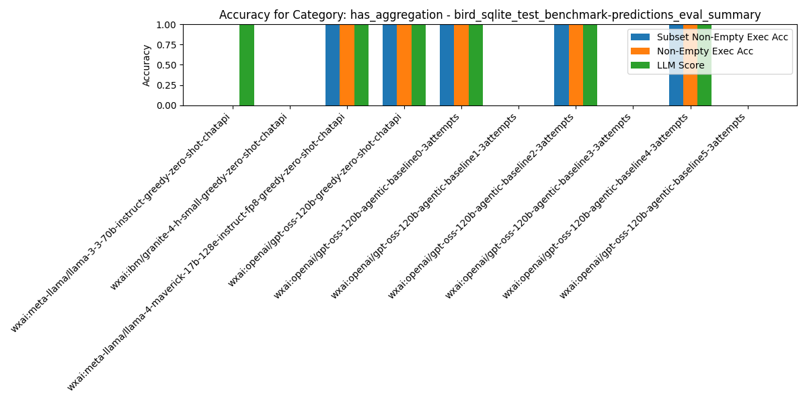
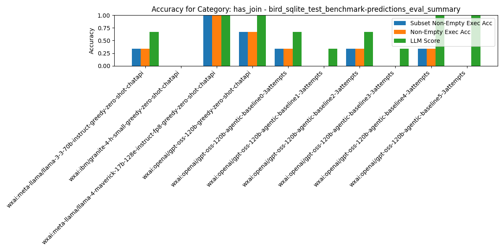
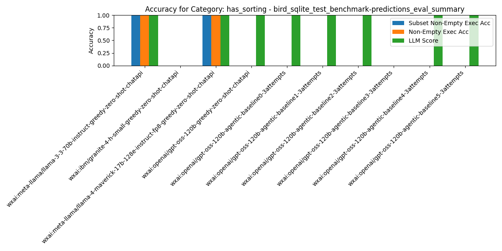
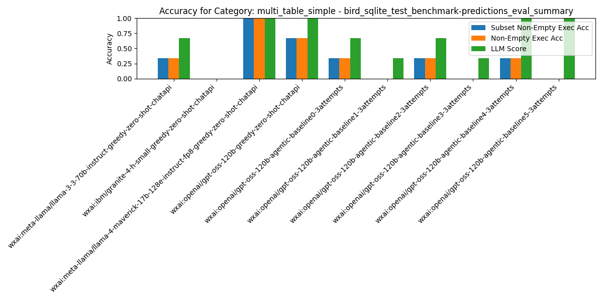

# Summary Results

## Overall Average Accuracy Results

| Rank | Pipeline | Records # | Predictions # | Exec Acc | Non-Empty Exec Acc | Subset Non-Empty Exec Acc | BIRD Exec Acc | Parsable SQL | Syntactic Equivalence Score | LLM Score |
| --- | --- | --- | --- | --- | --- | --- | --- | --- | --- | --- |
| 1 | wxai:meta-llama/llama-4-maverick-17b-128e-instruct-fp8-greedy-zero-shot-chatapi | 3 | 0 | 1.00 | 1.00 | 1.00 | 1.00 | 1.00 | 0.00 | 1.00 |
| 2 | wxai:openai/gpt-oss-120b-greedy-zero-shot-chatapi | 3 | 0 | 0.67 | 0.67 | 0.67 | 0.67 | 1.00 | 0.00 | 1.00 |
| 3 | wxai:meta-llama/llama-3-3-70b-instruct-greedy-zero-shot-chatapi | 3 | 0 | 0.33 | 0.33 | 0.33 | 0.33 | 1.00 | 0.00 | 0.67 |
| 4 | wxai:openai/gpt-oss-120b-agentic-baseline0-3attempts | 3 | 0 | 0.33 | 0.33 | 0.33 | 0.33 | 1.00 | 0.00 | 0.67 |
| 5 | wxai:openai/gpt-oss-120b-agentic-baseline2-3attempts | 3 | 0 | 0.33 | 0.33 | 0.33 | 0.33 | 1.00 | 0.00 | 0.67 |
| 6 | wxai:openai/gpt-oss-120b-agentic-baseline4-3attempts | 3 | 0 | 0.33 | 0.33 | 0.33 | 0.33 | 1.00 | 0.00 | 1.00 |
| 7 | wxai:ibm/granite-4-h-small-greedy-zero-shot-chatapi | 3 | 0 | 0.00 | 0.00 | 0.00 | 0.00 | 1.00 | 0.00 | 0.00 |
| 8 | wxai:openai/gpt-oss-120b-agentic-baseline1-3attempts | 3 | 0 | 0.00 | 0.00 | 0.00 | 0.00 | 1.00 | 0.00 | 0.33 |
| 9 | wxai:openai/gpt-oss-120b-agentic-baseline3-3attempts | 3 | 0 | 0.00 | 0.00 | 0.00 | 0.00 | 1.00 | 0.00 | 0.33 |
| 10 | wxai:openai/gpt-oss-120b-agentic-baseline5-3attempts | 3 | 0 | 0.00 | 0.00 | 0.00 | 0.00 | 1.00 | 0.00 | 1.00 |

## Category: `has_aggregation`

| Rank | Pipeline | Records # | Predictions # | Exec Acc | Non-Empty Exec Acc | Subset Non-Empty Exec Acc | BIRD Exec Acc | Parsable SQL | Syntactic Equivalence Score | LLM Score |
| --- | --- | --- | --- | --- | --- | --- | --- | --- | --- | --- |
| 1 | wxai:meta-llama/llama-4-maverick-17b-128e-instruct-fp8-greedy-zero-shot-chatapi | 1 | 0 | 1.00 | 1.00 | 1.00 | 1.00 | 1.00 | 0.00 | 1.00 |
| 2 | wxai:openai/gpt-oss-120b-greedy-zero-shot-chatapi | 1 | 0 | 1.00 | 1.00 | 1.00 | 1.00 | 1.00 | 0.00 | 1.00 |
| 3 | wxai:openai/gpt-oss-120b-agentic-baseline0-3attempts | 1 | 0 | 1.00 | 1.00 | 1.00 | 1.00 | 1.00 | 0.00 | 1.00 |
| 4 | wxai:openai/gpt-oss-120b-agentic-baseline2-3attempts | 1 | 0 | 1.00 | 1.00 | 1.00 | 1.00 | 1.00 | 0.00 | 1.00 |
| 5 | wxai:openai/gpt-oss-120b-agentic-baseline4-3attempts | 1 | 0 | 1.00 | 1.00 | 1.00 | 1.00 | 1.00 | 0.00 | 1.00 |
| 6 | wxai:meta-llama/llama-3-3-70b-instruct-greedy-zero-shot-chatapi | 1 | 0 | 0.00 | 0.00 | 0.00 | 0.00 | 1.00 | 0.00 | 1.00 |
| 7 | wxai:ibm/granite-4-h-small-greedy-zero-shot-chatapi | 1 | 0 | 0.00 | 0.00 | 0.00 | 0.00 | 1.00 | 0.00 | 0.00 |
| 8 | wxai:openai/gpt-oss-120b-agentic-baseline1-3attempts | 1 | 0 | 0.00 | 0.00 | 0.00 | 0.00 | 1.00 | 0.00 | 0.00 |
| 9 | wxai:openai/gpt-oss-120b-agentic-baseline3-3attempts | 1 | 0 | 0.00 | 0.00 | 0.00 | 0.00 | 1.00 | 0.00 | 0.00 |
| 10 | wxai:openai/gpt-oss-120b-agentic-baseline5-3attempts | 1 | 0 | 0.00 | 0.00 | 0.00 | 0.00 | 0.00 | 0.00 | 0.00 |

## Category: `has_join`

| Rank | Pipeline | Records # | Predictions # | Exec Acc | Non-Empty Exec Acc | Subset Non-Empty Exec Acc | BIRD Exec Acc | Parsable SQL | Syntactic Equivalence Score | LLM Score |
| --- | --- | --- | --- | --- | --- | --- | --- | --- | --- | --- |
| 1 | wxai:meta-llama/llama-4-maverick-17b-128e-instruct-fp8-greedy-zero-shot-chatapi | 3 | 0 | 1.00 | 1.00 | 1.00 | 1.00 | 1.00 | 0.00 | 1.00 |
| 2 | wxai:openai/gpt-oss-120b-greedy-zero-shot-chatapi | 3 | 0 | 0.67 | 0.67 | 0.67 | 0.67 | 1.00 | 0.00 | 1.00 |
| 3 | wxai:meta-llama/llama-3-3-70b-instruct-greedy-zero-shot-chatapi | 3 | 0 | 0.33 | 0.33 | 0.33 | 0.33 | 1.00 | 0.00 | 0.67 |
| 4 | wxai:openai/gpt-oss-120b-agentic-baseline0-3attempts | 3 | 0 | 0.33 | 0.33 | 0.33 | 0.33 | 1.00 | 0.00 | 0.67 |
| 5 | wxai:openai/gpt-oss-120b-agentic-baseline2-3attempts | 3 | 0 | 0.33 | 0.33 | 0.33 | 0.33 | 1.00 | 0.00 | 0.67 |
| 6 | wxai:openai/gpt-oss-120b-agentic-baseline4-3attempts | 3 | 0 | 0.33 | 0.33 | 0.33 | 0.33 | 1.00 | 0.00 | 1.00 |
| 7 | wxai:ibm/granite-4-h-small-greedy-zero-shot-chatapi | 3 | 0 | 0.00 | 0.00 | 0.00 | 0.00 | 1.00 | 0.00 | 0.00 |
| 8 | wxai:openai/gpt-oss-120b-agentic-baseline1-3attempts | 3 | 0 | 0.00 | 0.00 | 0.00 | 0.00 | 1.00 | 0.00 | 0.33 |
| 9 | wxai:openai/gpt-oss-120b-agentic-baseline3-3attempts | 3 | 0 | 0.00 | 0.00 | 0.00 | 0.00 | 1.00 | 0.00 | 0.33 |
| 10 | wxai:openai/gpt-oss-120b-agentic-baseline5-3attempts | 3 | 0 | 0.00 | 0.00 | 0.00 | 0.00 | 1.00 | 0.00 | 1.00 |

## Category: `has_sorting`

| Rank | Pipeline | Records # | Predictions # | Exec Acc | Non-Empty Exec Acc | Subset Non-Empty Exec Acc | BIRD Exec Acc | Parsable SQL | Syntactic Equivalence Score | LLM Score |
| --- | --- | --- | --- | --- | --- | --- | --- | --- | --- | --- |
| 1 | wxai:meta-llama/llama-3-3-70b-instruct-greedy-zero-shot-chatapi | 1 | 0 | 1.00 | 1.00 | 1.00 | 1.00 | 1.00 | 0.00 | 1.00 |
| 2 | wxai:meta-llama/llama-4-maverick-17b-128e-instruct-fp8-greedy-zero-shot-chatapi | 1 | 0 | 1.00 | 1.00 | 1.00 | 1.00 | 1.00 | 0.00 | 1.00 |
| 3 | wxai:ibm/granite-4-h-small-greedy-zero-shot-chatapi | 1 | 0 | 0.00 | 0.00 | 0.00 | 0.00 | 1.00 | 0.00 | 0.00 |
| 4 | wxai:openai/gpt-oss-120b-greedy-zero-shot-chatapi | 1 | 0 | 0.00 | 0.00 | 0.00 | 0.00 | 1.00 | 0.00 | 1.00 |
| 5 | wxai:openai/gpt-oss-120b-agentic-baseline0-3attempts | 1 | 0 | 0.00 | 0.00 | 0.00 | 0.00 | 1.00 | 0.00 | 1.00 |
| 6 | wxai:openai/gpt-oss-120b-agentic-baseline1-3attempts | 1 | 0 | 0.00 | 0.00 | 0.00 | 0.00 | 1.00 | 0.00 | 1.00 |
| 7 | wxai:openai/gpt-oss-120b-agentic-baseline2-3attempts | 1 | 0 | 0.00 | 0.00 | 0.00 | 0.00 | 1.00 | 0.00 | 1.00 |
| 8 | wxai:openai/gpt-oss-120b-agentic-baseline3-3attempts | 1 | 0 | 0.00 | 0.00 | 0.00 | 0.00 | 1.00 | 0.00 | 0.00 |
| 9 | wxai:openai/gpt-oss-120b-agentic-baseline4-3attempts | 1 | 0 | 0.00 | 0.00 | 0.00 | 0.00 | 1.00 | 0.00 | 1.00 |
| 10 | wxai:openai/gpt-oss-120b-agentic-baseline5-3attempts | 1 | 0 | 0.00 | 0.00 | 0.00 | 0.00 | 1.00 | 0.00 | 1.00 |

## Category: `multi_table_simple`

| Rank | Pipeline | Records # | Predictions # | Exec Acc | Non-Empty Exec Acc | Subset Non-Empty Exec Acc | BIRD Exec Acc | Parsable SQL | Syntactic Equivalence Score | LLM Score |
| --- | --- | --- | --- | --- | --- | --- | --- | --- | --- | --- |
| 1 | wxai:meta-llama/llama-4-maverick-17b-128e-instruct-fp8-greedy-zero-shot-chatapi | 3 | 0 | 1.00 | 1.00 | 1.00 | 1.00 | 1.00 | 0.00 | 1.00 |
| 2 | wxai:openai/gpt-oss-120b-greedy-zero-shot-chatapi | 3 | 0 | 0.67 | 0.67 | 0.67 | 0.67 | 1.00 | 0.00 | 1.00 |
| 3 | wxai:meta-llama/llama-3-3-70b-instruct-greedy-zero-shot-chatapi | 3 | 0 | 0.33 | 0.33 | 0.33 | 0.33 | 1.00 | 0.00 | 0.67 |
| 4 | wxai:openai/gpt-oss-120b-agentic-baseline0-3attempts | 3 | 0 | 0.33 | 0.33 | 0.33 | 0.33 | 1.00 | 0.00 | 0.67 |
| 5 | wxai:openai/gpt-oss-120b-agentic-baseline2-3attempts | 3 | 0 | 0.33 | 0.33 | 0.33 | 0.33 | 1.00 | 0.00 | 0.67 |
| 6 | wxai:openai/gpt-oss-120b-agentic-baseline4-3attempts | 3 | 0 | 0.33 | 0.33 | 0.33 | 0.33 | 1.00 | 0.00 | 1.00 |
| 7 | wxai:ibm/granite-4-h-small-greedy-zero-shot-chatapi | 3 | 0 | 0.00 | 0.00 | 0.00 | 0.00 | 1.00 | 0.00 | 0.00 |
| 8 | wxai:openai/gpt-oss-120b-agentic-baseline1-3attempts | 3 | 0 | 0.00 | 0.00 | 0.00 | 0.00 | 1.00 | 0.00 | 0.33 |
| 9 | wxai:openai/gpt-oss-120b-agentic-baseline3-3attempts | 3 | 0 | 0.00 | 0.00 | 0.00 | 0.00 | 1.00 | 0.00 | 0.33 |
| 10 | wxai:openai/gpt-oss-120b-agentic-baseline5-3attempts | 3 | 0 | 0.00 | 0.00 | 0.00 | 0.00 | 1.00 | 0.00 | 1.00 |

# Per-Pipeline Comparison Across Categories

### Pipeline: `wxai:ibm/granite-4-h-small-greedy-zero-shot-chatapi`
| Category | # Records | # Predictions | Exec Acc | Non-Empty Exec Acc | Subset Non-Empty Exec Acc | BIRD Exec Acc | LLM Score |
|---|---|---|---|---|---|---|---|
| All Categories | 3 | 0 | 0.000 | 0.000 | 0.000 | 0.000 | 0.000 |
| has_aggregation | 1 | 0 | 0.000 | 0.000 | 0.000 | 0.000 | 0.000 |
| has_join | 3 | 0 | 0.000 | 0.000 | 0.000 | 0.000 | 0.000 |
| has_sorting | 1 | 0 | 0.000 | 0.000 | 0.000 | 0.000 | 0.000 |
| multi_table_simple | 3 | 0 | 0.000 | 0.000 | 0.000 | 0.000 | 0.000 |

### Pipeline: `wxai:meta-llama/llama-3-3-70b-instruct-greedy-zero-shot-chatapi`
| Category | # Records | # Predictions | Exec Acc | Non-Empty Exec Acc | Subset Non-Empty Exec Acc | BIRD Exec Acc | LLM Score |
|---|---|---|---|---|---|---|---|
| All Categories | 3 | 0 | 0.333 | 0.333 | 0.333 | 0.333 | 0.667 |
| has_aggregation | 1 | 0 | 0.000 | 0.000 | 0.000 | 0.000 | 1.000 |
| has_join | 3 | 0 | 0.333 | 0.333 | 0.333 | 0.333 | 0.667 |
| has_sorting | 1 | 0 | 1.000 | 1.000 | 1.000 | 1.000 | 1.000 |
| multi_table_simple | 3 | 0 | 0.333 | 0.333 | 0.333 | 0.333 | 0.667 |

### Pipeline: `wxai:meta-llama/llama-4-maverick-17b-128e-instruct-fp8-greedy-zero-shot-chatapi`
| Category | # Records | # Predictions | Exec Acc | Non-Empty Exec Acc | Subset Non-Empty Exec Acc | BIRD Exec Acc | LLM Score |
|---|---|---|---|---|---|---|---|
| All Categories | 3 | 0 | 1.000 | 1.000 | 1.000 | 1.000 | 1.000 |
| has_aggregation | 1 | 0 | 1.000 | 1.000 | 1.000 | 1.000 | 1.000 |
| has_join | 3 | 0 | 1.000 | 1.000 | 1.000 | 1.000 | 1.000 |
| has_sorting | 1 | 0 | 1.000 | 1.000 | 1.000 | 1.000 | 1.000 |
| multi_table_simple | 3 | 0 | 1.000 | 1.000 | 1.000 | 1.000 | 1.000 |

### Pipeline: `wxai:openai/gpt-oss-120b-agentic-baseline0-3attempts`
| Category | # Records | # Predictions | Exec Acc | Non-Empty Exec Acc | Subset Non-Empty Exec Acc | BIRD Exec Acc | LLM Score |
|---|---|---|---|---|---|---|---|
| All Categories | 3 | 0 | 0.333 | 0.333 | 0.333 | 0.333 | 0.667 |
| has_aggregation | 1 | 0 | 1.000 | 1.000 | 1.000 | 1.000 | 1.000 |
| has_join | 3 | 0 | 0.333 | 0.333 | 0.333 | 0.333 | 0.667 |
| has_sorting | 1 | 0 | 0.000 | 0.000 | 0.000 | 0.000 | 1.000 |
| multi_table_simple | 3 | 0 | 0.333 | 0.333 | 0.333 | 0.333 | 0.667 |

### Pipeline: `wxai:openai/gpt-oss-120b-agentic-baseline1-3attempts`
| Category | # Records | # Predictions | Exec Acc | Non-Empty Exec Acc | Subset Non-Empty Exec Acc | BIRD Exec Acc | LLM Score |
|---|---|---|---|---|---|---|---|
| All Categories | 3 | 0 | 0.000 | 0.000 | 0.000 | 0.000 | 0.333 |
| has_aggregation | 1 | 0 | 0.000 | 0.000 | 0.000 | 0.000 | 0.000 |
| has_join | 3 | 0 | 0.000 | 0.000 | 0.000 | 0.000 | 0.333 |
| has_sorting | 1 | 0 | 0.000 | 0.000 | 0.000 | 0.000 | 1.000 |
| multi_table_simple | 3 | 0 | 0.000 | 0.000 | 0.000 | 0.000 | 0.333 |

### Pipeline: `wxai:openai/gpt-oss-120b-agentic-baseline2-3attempts`
| Category | # Records | # Predictions | Exec Acc | Non-Empty Exec Acc | Subset Non-Empty Exec Acc | BIRD Exec Acc | LLM Score |
|---|---|---|---|---|---|---|---|
| All Categories | 3 | 0 | 0.333 | 0.333 | 0.333 | 0.333 | 0.667 |
| has_aggregation | 1 | 0 | 1.000 | 1.000 | 1.000 | 1.000 | 1.000 |
| has_join | 3 | 0 | 0.333 | 0.333 | 0.333 | 0.333 | 0.667 |
| has_sorting | 1 | 0 | 0.000 | 0.000 | 0.000 | 0.000 | 1.000 |
| multi_table_simple | 3 | 0 | 0.333 | 0.333 | 0.333 | 0.333 | 0.667 |

### Pipeline: `wxai:openai/gpt-oss-120b-agentic-baseline3-3attempts`
| Category | # Records | # Predictions | Exec Acc | Non-Empty Exec Acc | Subset Non-Empty Exec Acc | BIRD Exec Acc | LLM Score |
|---|---|---|---|---|---|---|---|
| All Categories | 3 | 0 | 0.000 | 0.000 | 0.000 | 0.000 | 0.333 |
| has_aggregation | 1 | 0 | 0.000 | 0.000 | 0.000 | 0.000 | 0.000 |
| has_join | 3 | 0 | 0.000 | 0.000 | 0.000 | 0.000 | 0.333 |
| has_sorting | 1 | 0 | 0.000 | 0.000 | 0.000 | 0.000 | 0.000 |
| multi_table_simple | 3 | 0 | 0.000 | 0.000 | 0.000 | 0.000 | 0.333 |

### Pipeline: `wxai:openai/gpt-oss-120b-agentic-baseline4-3attempts`
| Category | # Records | # Predictions | Exec Acc | Non-Empty Exec Acc | Subset Non-Empty Exec Acc | BIRD Exec Acc | LLM Score |
|---|---|---|---|---|---|---|---|
| All Categories | 3 | 0 | 0.333 | 0.333 | 0.333 | 0.333 | 1.000 |
| has_aggregation | 1 | 0 | 1.000 | 1.000 | 1.000 | 1.000 | 1.000 |
| has_join | 3 | 0 | 0.333 | 0.333 | 0.333 | 0.333 | 1.000 |
| has_sorting | 1 | 0 | 0.000 | 0.000 | 0.000 | 0.000 | 1.000 |
| multi_table_simple | 3 | 0 | 0.333 | 0.333 | 0.333 | 0.333 | 1.000 |

### Pipeline: `wxai:openai/gpt-oss-120b-agentic-baseline5-3attempts`
| Category | # Records | # Predictions | Exec Acc | Non-Empty Exec Acc | Subset Non-Empty Exec Acc | BIRD Exec Acc | LLM Score |
|---|---|---|---|---|---|---|---|
| All Categories | 3 | 0 | 0.000 | 0.000 | 0.000 | 0.000 | 1.000 |
| has_aggregation | 1 | 0 | - | - | - | - | - |
| has_join | 3 | 0 | 0.000 | 0.000 | 0.000 | 0.000 | 1.000 |
| has_sorting | 1 | 0 | 0.000 | 0.000 | 0.000 | 0.000 | 1.000 |
| multi_table_simple | 3 | 0 | 0.000 | 0.000 | 0.000 | 0.000 | 1.000 |

### Pipeline: `wxai:openai/gpt-oss-120b-greedy-zero-shot-chatapi`
| Category | # Records | # Predictions | Exec Acc | Non-Empty Exec Acc | Subset Non-Empty Exec Acc | BIRD Exec Acc | LLM Score |
|---|---|---|---|---|---|---|---|
| All Categories | 3 | 0 | 0.667 | 0.667 | 0.667 | 0.667 | 1.000 |
| has_aggregation | 1 | 0 | 1.000 | 1.000 | 1.000 | 1.000 | 1.000 |
| has_join | 3 | 0 | 0.667 | 0.667 | 0.667 | 0.667 | 1.000 |
| has_sorting | 1 | 0 | 0.000 | 0.000 | 0.000 | 0.000 | 1.000 |
| multi_table_simple | 3 | 0 | 0.667 | 0.667 | 0.667 | 0.667 | 1.000 |