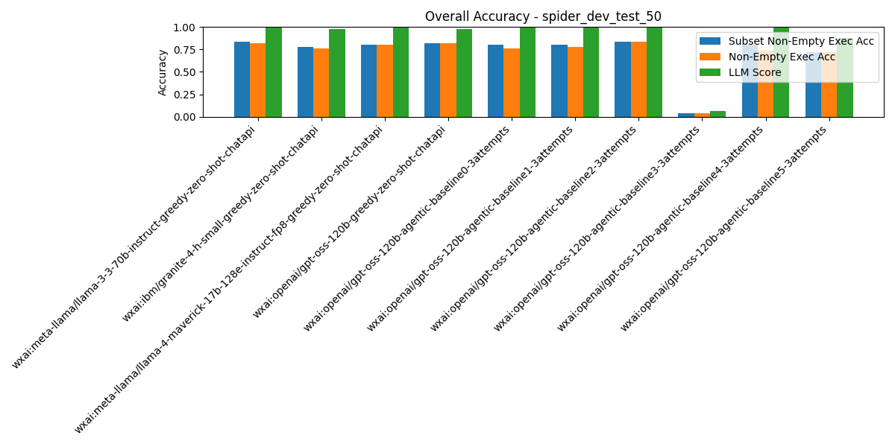

# Summary Results

## Overall Average Accuracy Results

| Rank | Pipeline | Records # | Predictions # | Exec Acc | Non-Empty Exec Acc | Subset Non-Empty Exec Acc | BIRD Exec Acc | Parsable SQL | Syntactic Equivalence Score | LLM Score |
| --- | --- | --- | --- | --- | --- | --- | --- | --- | --- | --- |
| 1 | wxai:meta-llama/llama-3-3-70b-instruct-greedy-zero-shot-chatapi | 50 | 0 | 0.84 | 0.82 | 0.84 | 0.86 | 1.00 | 0.24 | 1.00 |
| 2 | wxai:openai/gpt-oss-120b-agentic-baseline2-3attempts | 50 | 0 | 0.84 | 0.84 | 0.84 | 0.86 | 1.00 | 0.32 | 1.00 |
| 3 | wxai:openai/gpt-oss-120b-greedy-zero-shot-chatapi | 50 | 0 | 0.82 | 0.82 | 0.82 | 0.84 | 1.00 | 0.34 | 0.98 |
| 4 | wxai:meta-llama/llama-4-maverick-17b-128e-instruct-fp8-greedy-zero-shot-chatapi | 50 | 0 | 0.82 | 0.80 | 0.80 | 0.84 | 1.00 | 0.22 | 1.00 |
| 5 | wxai:openai/gpt-oss-120b-agentic-baseline0-3attempts | 50 | 0 | 0.76 | 0.76 | 0.80 | 0.76 | 1.00 | 0.26 | 1.00 |
| 6 | wxai:openai/gpt-oss-120b-agentic-baseline1-3attempts | 50 | 0 | 0.78 | 0.78 | 0.80 | 0.80 | 1.00 | 0.34 | 1.00 |
| 7 | wxai:openai/gpt-oss-120b-agentic-baseline4-3attempts | 50 | 0 | 0.74 | 0.74 | 0.80 | 0.74 | 1.00 | 0.32 | 1.00 |
| 8 | wxai:ibm/granite-4-h-small-greedy-zero-shot-chatapi | 50 | 0 | 0.78 | 0.76 | 0.78 | 0.84 | 1.00 | 0.32 | 0.98 |
| 9 | wxai:openai/gpt-oss-120b-agentic-baseline5-3attempts | 50 | 0 | 0.75 | 0.75 | 0.75 | 0.75 | 1.00 | 0.31 | 0.92 |
| 10 | wxai:openai/gpt-oss-120b-agentic-baseline3-3attempts | 50 | 0 | 0.04 | 0.04 | 0.04 | 0.04 | 1.00 | 0.28 | 0.06 |

# Per-Pipeline Comparison Across Categories
