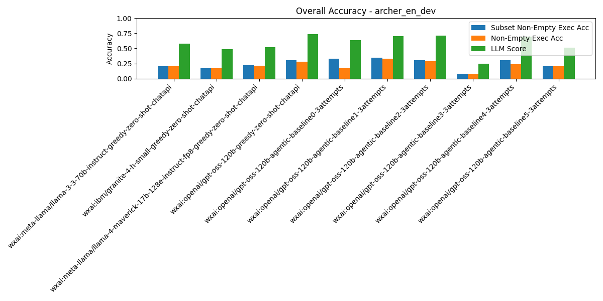
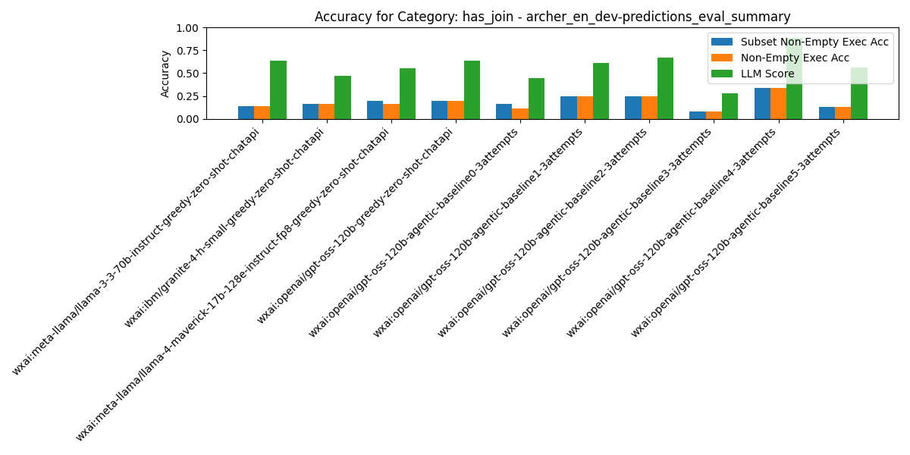
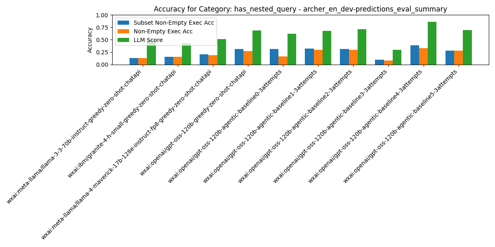
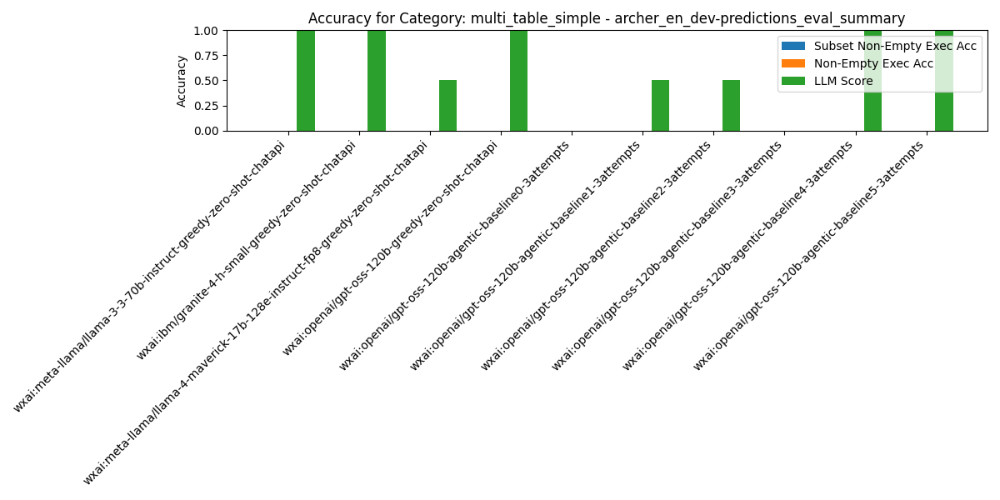
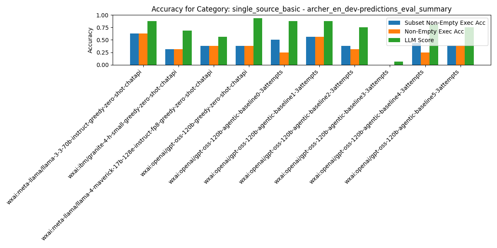

# Summary Results

## Overall Average Accuracy Results

| Rank | Pipeline | Records # | Predictions # | Exec Acc | Non-Empty Exec Acc | Subset Non-Empty Exec Acc | BIRD Exec Acc | Parsable SQL | Syntactic Equivalence Score | LLM Score |
| --- | --- | --- | --- | --- | --- | --- | --- | --- | --- | --- |
| 1 | wxai:openai/gpt-oss-120b-agentic-baseline4-3attempts | 104 | 0 | 0.30 | 0.30 | 0.38 | 0.30 | 1.00 | 0.00 | 0.86 |
| 2 | wxai:openai/gpt-oss-120b-agentic-baseline1-3attempts | 104 | 0 | 0.33 | 0.33 | 0.35 | 0.34 | 1.00 | 0.00 | 0.70 |
| 3 | wxai:openai/gpt-oss-120b-agentic-baseline0-3attempts | 104 | 0 | 0.18 | 0.17 | 0.33 | 0.19 | 1.00 | 0.00 | 0.63 |
| 4 | wxai:openai/gpt-oss-120b-greedy-zero-shot-chatapi | 104 | 0 | 0.30 | 0.28 | 0.31 | 0.31 | 1.00 | 0.00 | 0.74 |
| 5 | wxai:openai/gpt-oss-120b-agentic-baseline2-3attempts | 104 | 0 | 0.33 | 0.29 | 0.31 | 0.35 | 1.00 | 0.00 | 0.71 |
| 6 | wxai:openai/gpt-oss-120b-agentic-baseline5-3attempts | 104 | 0 | 0.30 | 0.29 | 0.29 | 0.30 | 1.00 | 0.00 | 0.73 |
| 7 | wxai:meta-llama/llama-4-maverick-17b-128e-instruct-fp8-greedy-zero-shot-chatapi | 104 | 0 | 0.23 | 0.21 | 0.22 | 0.24 | 1.00 | 0.00 | 0.52 |
| 8 | wxai:meta-llama/llama-3-3-70b-instruct-greedy-zero-shot-chatapi | 104 | 0 | 0.20 | 0.20 | 0.20 | 0.20 | 1.00 | 0.00 | 0.58 |
| 9 | wxai:ibm/granite-4-h-small-greedy-zero-shot-chatapi | 104 | 0 | 0.17 | 0.17 | 0.17 | 0.17 | 1.00 | 0.00 | 0.49 |
| 10 | wxai:openai/gpt-oss-120b-agentic-baseline3-3attempts | 104 | 0 | 0.08 | 0.07 | 0.08 | 0.08 | 0.98 | 0.00 | 0.25 |

## Category: `has_aggregation`

| Rank | Pipeline | Records # | Predictions # | Exec Acc | Non-Empty Exec Acc | Subset Non-Empty Exec Acc | BIRD Exec Acc | Parsable SQL | Syntactic Equivalence Score | LLM Score |
| --- | --- | --- | --- | --- | --- | --- | --- | --- | --- | --- |
| 1 | wxai:openai/gpt-oss-120b-agentic-baseline4-3attempts | 56 | 0 | 0.35 | 0.35 | 0.43 | 0.35 | 1.00 | 0.00 | 0.89 |
| 2 | wxai:openai/gpt-oss-120b-agentic-baseline0-3attempts | 56 | 0 | 0.25 | 0.23 | 0.34 | 0.25 | 1.00 | 0.00 | 0.70 |
| 3 | wxai:openai/gpt-oss-120b-agentic-baseline1-3attempts | 56 | 0 | 0.34 | 0.34 | 0.34 | 0.34 | 1.00 | 0.00 | 0.77 |
| 4 | wxai:openai/gpt-oss-120b-greedy-zero-shot-chatapi | 56 | 0 | 0.30 | 0.27 | 0.30 | 0.30 | 1.00 | 0.00 | 0.70 |
| 5 | wxai:openai/gpt-oss-120b-agentic-baseline2-3attempts | 56 | 0 | 0.38 | 0.30 | 0.30 | 0.38 | 1.00 | 0.00 | 0.84 |
| 6 | wxai:openai/gpt-oss-120b-agentic-baseline5-3attempts | 56 | 0 | 0.30 | 0.27 | 0.27 | 0.30 | 1.00 | 0.00 | 0.70 |
| 7 | wxai:meta-llama/llama-4-maverick-17b-128e-instruct-fp8-greedy-zero-shot-chatapi | 56 | 0 | 0.21 | 0.18 | 0.20 | 0.21 | 1.00 | 0.00 | 0.52 |
| 8 | wxai:meta-llama/llama-3-3-70b-instruct-greedy-zero-shot-chatapi | 56 | 0 | 0.18 | 0.18 | 0.18 | 0.18 | 1.00 | 0.00 | 0.59 |
| 9 | wxai:ibm/granite-4-h-small-greedy-zero-shot-chatapi | 56 | 0 | 0.14 | 0.14 | 0.14 | 0.14 | 1.00 | 0.00 | 0.48 |
| 10 | wxai:openai/gpt-oss-120b-agentic-baseline3-3attempts | 56 | 0 | 0.09 | 0.07 | 0.07 | 0.09 | 0.96 | 0.00 | 0.32 |

## Category: `has_join`

| Rank | Pipeline | Records # | Predictions # | Exec Acc | Non-Empty Exec Acc | Subset Non-Empty Exec Acc | BIRD Exec Acc | Parsable SQL | Syntactic Equivalence Score | LLM Score |
| --- | --- | --- | --- | --- | --- | --- | --- | --- | --- | --- |
| 1 | wxai:openai/gpt-oss-120b-agentic-baseline4-3attempts | 36 | 0 | 0.33 | 0.33 | 0.33 | 0.33 | 1.00 | 0.00 | 0.89 |
| 2 | wxai:openai/gpt-oss-120b-agentic-baseline1-3attempts | 36 | 0 | 0.25 | 0.25 | 0.25 | 0.25 | 1.00 | 0.00 | 0.61 |
| 3 | wxai:openai/gpt-oss-120b-agentic-baseline2-3attempts | 36 | 0 | 0.25 | 0.25 | 0.25 | 0.25 | 1.00 | 0.00 | 0.67 |
| 4 | wxai:meta-llama/llama-4-maverick-17b-128e-instruct-fp8-greedy-zero-shot-chatapi | 36 | 0 | 0.17 | 0.17 | 0.19 | 0.17 | 1.00 | 0.00 | 0.56 |
| 5 | wxai:openai/gpt-oss-120b-greedy-zero-shot-chatapi | 36 | 0 | 0.19 | 0.19 | 0.19 | 0.19 | 1.00 | 0.00 | 0.64 |
| 6 | wxai:ibm/granite-4-h-small-greedy-zero-shot-chatapi | 36 | 0 | 0.17 | 0.17 | 0.17 | 0.17 | 1.00 | 0.00 | 0.47 |
| 7 | wxai:openai/gpt-oss-120b-agentic-baseline0-3attempts | 36 | 0 | 0.11 | 0.11 | 0.17 | 0.11 | 1.00 | 0.00 | 0.44 |
| 8 | wxai:meta-llama/llama-3-3-70b-instruct-greedy-zero-shot-chatapi | 36 | 0 | 0.14 | 0.14 | 0.14 | 0.14 | 1.00 | 0.00 | 0.64 |
| 9 | wxai:openai/gpt-oss-120b-agentic-baseline5-3attempts | 36 | 0 | 0.13 | 0.13 | 0.13 | 0.13 | 1.00 | 0.00 | 0.57 |
| 10 | wxai:openai/gpt-oss-120b-agentic-baseline3-3attempts | 36 | 0 | 0.08 | 0.08 | 0.08 | 0.08 | 0.97 | 0.00 | 0.28 |

## Category: `has_nested_query`

| Rank | Pipeline | Records # | Predictions # | Exec Acc | Non-Empty Exec Acc | Subset Non-Empty Exec Acc | BIRD Exec Acc | Parsable SQL | Syntactic Equivalence Score | LLM Score |
| --- | --- | --- | --- | --- | --- | --- | --- | --- | --- | --- |
| 1 | wxai:openai/gpt-oss-120b-agentic-baseline4-3attempts | 84 | 0 | 0.33 | 0.33 | 0.39 | 0.33 | 1.00 | 0.00 | 0.86 |
| 2 | wxai:openai/gpt-oss-120b-agentic-baseline1-3attempts | 84 | 0 | 0.30 | 0.30 | 0.32 | 0.31 | 1.00 | 0.00 | 0.68 |
| 3 | wxai:openai/gpt-oss-120b-greedy-zero-shot-chatapi | 84 | 0 | 0.30 | 0.27 | 0.31 | 0.31 | 1.00 | 0.00 | 0.69 |
| 4 | wxai:openai/gpt-oss-120b-agentic-baseline0-3attempts | 84 | 0 | 0.18 | 0.17 | 0.31 | 0.19 | 1.00 | 0.00 | 0.62 |
| 5 | wxai:openai/gpt-oss-120b-agentic-baseline2-3attempts | 84 | 0 | 0.35 | 0.30 | 0.31 | 0.37 | 1.00 | 0.00 | 0.71 |
| 6 | wxai:openai/gpt-oss-120b-agentic-baseline5-3attempts | 84 | 0 | 0.30 | 0.28 | 0.28 | 0.30 | 1.00 | 0.00 | 0.70 |
| 7 | wxai:meta-llama/llama-4-maverick-17b-128e-instruct-fp8-greedy-zero-shot-chatapi | 84 | 0 | 0.21 | 0.19 | 0.20 | 0.23 | 1.00 | 0.00 | 0.51 |
| 8 | wxai:ibm/granite-4-h-small-greedy-zero-shot-chatapi | 84 | 0 | 0.15 | 0.15 | 0.15 | 0.15 | 1.00 | 0.00 | 0.43 |
| 9 | wxai:meta-llama/llama-3-3-70b-instruct-greedy-zero-shot-chatapi | 84 | 0 | 0.13 | 0.13 | 0.13 | 0.13 | 1.00 | 0.00 | 0.50 |
| 10 | wxai:openai/gpt-oss-120b-agentic-baseline3-3attempts | 84 | 0 | 0.10 | 0.08 | 0.10 | 0.10 | 0.98 | 0.00 | 0.30 |

## Category: `has_sorting`

| Rank | Pipeline | Records # | Predictions # | Exec Acc | Non-Empty Exec Acc | Subset Non-Empty Exec Acc | BIRD Exec Acc | Parsable SQL | Syntactic Equivalence Score | LLM Score |
| --- | --- | --- | --- | --- | --- | --- | --- | --- | --- | --- |
| 1 | wxai:openai/gpt-oss-120b-agentic-baseline5-3attempts | 34 | 0 | 0.57 | 0.57 | 0.57 | 0.57 | 1.00 | 0.00 | 0.95 |
| 2 | wxai:openai/gpt-oss-120b-agentic-baseline4-3attempts | 34 | 0 | 0.30 | 0.30 | 0.52 | 0.30 | 1.00 | 0.00 | 0.96 |
| 3 | wxai:openai/gpt-oss-120b-greedy-zero-shot-chatapi | 34 | 0 | 0.41 | 0.41 | 0.50 | 0.44 | 1.00 | 0.00 | 0.82 |
| 4 | wxai:openai/gpt-oss-120b-agentic-baseline0-3attempts | 34 | 0 | 0.15 | 0.15 | 0.47 | 0.18 | 1.00 | 0.00 | 0.76 |
| 5 | wxai:openai/gpt-oss-120b-agentic-baseline1-3attempts | 34 | 0 | 0.38 | 0.38 | 0.44 | 0.41 | 1.00 | 0.00 | 0.79 |
| 6 | wxai:openai/gpt-oss-120b-agentic-baseline2-3attempts | 34 | 0 | 0.38 | 0.38 | 0.44 | 0.44 | 1.00 | 0.00 | 0.85 |
| 7 | wxai:meta-llama/llama-4-maverick-17b-128e-instruct-fp8-greedy-zero-shot-chatapi | 34 | 0 | 0.24 | 0.24 | 0.24 | 0.26 | 1.00 | 0.00 | 0.62 |
| 8 | wxai:ibm/granite-4-h-small-greedy-zero-shot-chatapi | 34 | 0 | 0.18 | 0.18 | 0.18 | 0.18 | 1.00 | 0.00 | 0.50 |
| 9 | wxai:meta-llama/llama-3-3-70b-instruct-greedy-zero-shot-chatapi | 34 | 0 | 0.12 | 0.12 | 0.12 | 0.12 | 1.00 | 0.00 | 0.53 |
| 10 | wxai:openai/gpt-oss-120b-agentic-baseline3-3attempts | 34 | 0 | 0.03 | 0.03 | 0.06 | 0.03 | 0.94 | 0.00 | 0.18 |

## Category: `multi_table_simple`

| Rank | Pipeline | Records # | Predictions # | Exec Acc | Non-Empty Exec Acc | Subset Non-Empty Exec Acc | BIRD Exec Acc | Parsable SQL | Syntactic Equivalence Score | LLM Score |
| --- | --- | --- | --- | --- | --- | --- | --- | --- | --- | --- |
| 1 | wxai:meta-llama/llama-3-3-70b-instruct-greedy-zero-shot-chatapi | 4 | 0 | 0.00 | 0.00 | 0.00 | 0.00 | 1.00 | 0.00 | 1.00 |
| 2 | wxai:ibm/granite-4-h-small-greedy-zero-shot-chatapi | 4 | 0 | 0.00 | 0.00 | 0.00 | 0.00 | 1.00 | 0.00 | 1.00 |
| 3 | wxai:meta-llama/llama-4-maverick-17b-128e-instruct-fp8-greedy-zero-shot-chatapi | 4 | 0 | 0.00 | 0.00 | 0.00 | 0.00 | 1.00 | 0.00 | 0.50 |
| 4 | wxai:openai/gpt-oss-120b-greedy-zero-shot-chatapi | 4 | 0 | 0.00 | 0.00 | 0.00 | 0.00 | 1.00 | 0.00 | 1.00 |
| 5 | wxai:openai/gpt-oss-120b-agentic-baseline0-3attempts | 4 | 0 | 0.00 | 0.00 | 0.00 | 0.00 | 1.00 | 0.00 | 0.00 |
| 6 | wxai:openai/gpt-oss-120b-agentic-baseline1-3attempts | 4 | 0 | 0.00 | 0.00 | 0.00 | 0.00 | 1.00 | 0.00 | 0.50 |
| 7 | wxai:openai/gpt-oss-120b-agentic-baseline2-3attempts | 4 | 0 | 0.00 | 0.00 | 0.00 | 0.00 | 1.00 | 0.00 | 0.50 |
| 8 | wxai:openai/gpt-oss-120b-agentic-baseline3-3attempts | 4 | 0 | 0.00 | 0.00 | 0.00 | 0.00 | 1.00 | 0.00 | 0.00 |
| 9 | wxai:openai/gpt-oss-120b-agentic-baseline4-3attempts | 4 | 0 | 0.00 | 0.00 | 0.00 | 0.00 | 1.00 | 0.00 | 1.00 |
| 10 | wxai:openai/gpt-oss-120b-agentic-baseline5-3attempts | 4 | 0 | 0.00 | 0.00 | 0.00 | 0.00 | 1.00 | 0.00 | 1.00 |

## Category: `single_source_basic`

| Rank | Pipeline | Records # | Predictions # | Exec Acc | Non-Empty Exec Acc | Subset Non-Empty Exec Acc | BIRD Exec Acc | Parsable SQL | Syntactic Equivalence Score | LLM Score |
| --- | --- | --- | --- | --- | --- | --- | --- | --- | --- | --- |
| 1 | wxai:meta-llama/llama-3-3-70b-instruct-greedy-zero-shot-chatapi | 16 | 0 | 0.62 | 0.62 | 0.62 | 0.62 | 1.00 | 0.00 | 0.88 |
| 2 | wxai:openai/gpt-oss-120b-agentic-baseline1-3attempts | 16 | 0 | 0.56 | 0.56 | 0.56 | 0.56 | 1.00 | 0.00 | 0.88 |
| 3 | wxai:openai/gpt-oss-120b-agentic-baseline0-3attempts | 16 | 0 | 0.25 | 0.25 | 0.50 | 0.25 | 1.00 | 0.00 | 0.88 |
| 4 | wxai:openai/gpt-oss-120b-agentic-baseline4-3attempts | 16 | 0 | 0.25 | 0.25 | 0.44 | 0.25 | 1.00 | 0.00 | 0.81 |
| 5 | wxai:meta-llama/llama-4-maverick-17b-128e-instruct-fp8-greedy-zero-shot-chatapi | 16 | 0 | 0.38 | 0.38 | 0.38 | 0.38 | 1.00 | 0.00 | 0.56 |
| 6 | wxai:openai/gpt-oss-120b-greedy-zero-shot-chatapi | 16 | 0 | 0.38 | 0.38 | 0.38 | 0.38 | 1.00 | 0.00 | 0.94 |
| 7 | wxai:openai/gpt-oss-120b-agentic-baseline2-3attempts | 16 | 0 | 0.31 | 0.31 | 0.38 | 0.31 | 1.00 | 0.00 | 0.75 |
| 8 | wxai:openai/gpt-oss-120b-agentic-baseline5-3attempts | 16 | 0 | 0.38 | 0.38 | 0.38 | 0.38 | 1.00 | 0.00 | 0.75 |
| 9 | wxai:ibm/granite-4-h-small-greedy-zero-shot-chatapi | 16 | 0 | 0.31 | 0.31 | 0.31 | 0.31 | 1.00 | 0.00 | 0.69 |
| 10 | wxai:openai/gpt-oss-120b-agentic-baseline3-3attempts | 16 | 0 | 0.00 | 0.00 | 0.00 | 0.00 | 1.00 | 0.00 | 0.06 |

# Per-Pipeline Comparison Across Categories

### Pipeline: `wxai:ibm/granite-4-h-small-greedy-zero-shot-chatapi`
| Category | # Records | # Predictions | Exec Acc | Non-Empty Exec Acc | Subset Non-Empty Exec Acc | BIRD Exec Acc | LLM Score |
|---|---|---|---|---|---|---|---|
| All Categories | 104 | 0 | 0.173 | 0.173 | 0.173 | 0.173 | 0.490 |
| has_aggregation | 56 | 0 | 0.143 | 0.143 | 0.143 | 0.143 | 0.482 |
| has_join | 36 | 0 | 0.167 | 0.167 | 0.167 | 0.167 | 0.472 |
| has_nested_query | 84 | 0 | 0.155 | 0.155 | 0.155 | 0.155 | 0.429 |
| has_sorting | 34 | 0 | 0.176 | 0.176 | 0.176 | 0.176 | 0.500 |
| multi_table_simple | 4 | 0 | 0.000 | 0.000 | 0.000 | 0.000 | 1.000 |
| single_source_basic | 16 | 0 | 0.312 | 0.312 | 0.312 | 0.312 | 0.688 |

### Pipeline: `wxai:meta-llama/llama-3-3-70b-instruct-greedy-zero-shot-chatapi`
| Category | # Records | # Predictions | Exec Acc | Non-Empty Exec Acc | Subset Non-Empty Exec Acc | BIRD Exec Acc | LLM Score |
|---|---|---|---|---|---|---|---|
| All Categories | 104 | 0 | 0.202 | 0.202 | 0.202 | 0.202 | 0.577 |
| has_aggregation | 56 | 0 | 0.179 | 0.179 | 0.179 | 0.179 | 0.589 |
| has_join | 36 | 0 | 0.139 | 0.139 | 0.139 | 0.139 | 0.639 |
| has_nested_query | 84 | 0 | 0.131 | 0.131 | 0.131 | 0.131 | 0.500 |
| has_sorting | 34 | 0 | 0.118 | 0.118 | 0.118 | 0.118 | 0.529 |
| multi_table_simple | 4 | 0 | 0.000 | 0.000 | 0.000 | 0.000 | 1.000 |
| single_source_basic | 16 | 0 | 0.625 | 0.625 | 0.625 | 0.625 | 0.875 |

### Pipeline: `wxai:meta-llama/llama-4-maverick-17b-128e-instruct-fp8-greedy-zero-shot-chatapi`
| Category | # Records | # Predictions | Exec Acc | Non-Empty Exec Acc | Subset Non-Empty Exec Acc | BIRD Exec Acc | LLM Score |
|---|---|---|---|---|---|---|---|
| All Categories | 104 | 0 | 0.231 | 0.212 | 0.221 | 0.240 | 0.519 |
| has_aggregation | 56 | 0 | 0.214 | 0.179 | 0.196 | 0.214 | 0.518 |
| has_join | 36 | 0 | 0.167 | 0.167 | 0.194 | 0.167 | 0.556 |
| has_nested_query | 84 | 0 | 0.214 | 0.190 | 0.202 | 0.226 | 0.512 |
| has_sorting | 34 | 0 | 0.235 | 0.235 | 0.235 | 0.265 | 0.618 |
| multi_table_simple | 4 | 0 | 0.000 | 0.000 | 0.000 | 0.000 | 0.500 |
| single_source_basic | 16 | 0 | 0.375 | 0.375 | 0.375 | 0.375 | 0.562 |

### Pipeline: `wxai:openai/gpt-oss-120b-agentic-baseline0-3attempts`
| Category | # Records | # Predictions | Exec Acc | Non-Empty Exec Acc | Subset Non-Empty Exec Acc | BIRD Exec Acc | LLM Score |
|---|---|---|---|---|---|---|---|
| All Categories | 104 | 0 | 0.183 | 0.173 | 0.327 | 0.192 | 0.635 |
| has_aggregation | 56 | 0 | 0.250 | 0.232 | 0.339 | 0.250 | 0.696 |
| has_join | 36 | 0 | 0.111 | 0.111 | 0.167 | 0.111 | 0.444 |
| has_nested_query | 84 | 0 | 0.179 | 0.167 | 0.310 | 0.190 | 0.619 |
| has_sorting | 34 | 0 | 0.147 | 0.147 | 0.471 | 0.176 | 0.765 |
| multi_table_simple | 4 | 0 | 0.000 | 0.000 | 0.000 | 0.000 | 0.000 |
| single_source_basic | 16 | 0 | 0.250 | 0.250 | 0.500 | 0.250 | 0.875 |

### Pipeline: `wxai:openai/gpt-oss-120b-agentic-baseline1-3attempts`
| Category | # Records | # Predictions | Exec Acc | Non-Empty Exec Acc | Subset Non-Empty Exec Acc | BIRD Exec Acc | LLM Score |
|---|---|---|---|---|---|---|---|
| All Categories | 104 | 0 | 0.327 | 0.327 | 0.346 | 0.337 | 0.702 |
| has_aggregation | 56 | 0 | 0.339 | 0.339 | 0.339 | 0.339 | 0.768 |
| has_join | 36 | 0 | 0.250 | 0.250 | 0.250 | 0.250 | 0.611 |
| has_nested_query | 84 | 0 | 0.298 | 0.298 | 0.321 | 0.310 | 0.679 |
| has_sorting | 34 | 0 | 0.382 | 0.382 | 0.441 | 0.412 | 0.794 |
| multi_table_simple | 4 | 0 | 0.000 | 0.000 | 0.000 | 0.000 | 0.500 |
| single_source_basic | 16 | 0 | 0.562 | 0.562 | 0.562 | 0.562 | 0.875 |

### Pipeline: `wxai:openai/gpt-oss-120b-agentic-baseline2-3attempts`
| Category | # Records | # Predictions | Exec Acc | Non-Empty Exec Acc | Subset Non-Empty Exec Acc | BIRD Exec Acc | LLM Score |
|---|---|---|---|---|---|---|---|
| All Categories | 104 | 0 | 0.327 | 0.288 | 0.308 | 0.346 | 0.712 |
| has_aggregation | 56 | 0 | 0.375 | 0.304 | 0.304 | 0.375 | 0.839 |
| has_join | 36 | 0 | 0.250 | 0.250 | 0.250 | 0.250 | 0.667 |
| has_nested_query | 84 | 0 | 0.345 | 0.298 | 0.310 | 0.369 | 0.714 |
| has_sorting | 34 | 0 | 0.382 | 0.382 | 0.441 | 0.441 | 0.853 |
| multi_table_simple | 4 | 0 | 0.000 | 0.000 | 0.000 | 0.000 | 0.500 |
| single_source_basic | 16 | 0 | 0.312 | 0.312 | 0.375 | 0.312 | 0.750 |

### Pipeline: `wxai:openai/gpt-oss-120b-agentic-baseline3-3attempts`
| Category | # Records | # Predictions | Exec Acc | Non-Empty Exec Acc | Subset Non-Empty Exec Acc | BIRD Exec Acc | LLM Score |
|---|---|---|---|---|---|---|---|
| All Categories | 104 | 0 | 0.077 | 0.067 | 0.077 | 0.077 | 0.250 |
| has_aggregation | 56 | 0 | 0.089 | 0.071 | 0.071 | 0.089 | 0.321 |
| has_join | 36 | 0 | 0.083 | 0.083 | 0.083 | 0.083 | 0.278 |
| has_nested_query | 84 | 0 | 0.095 | 0.083 | 0.095 | 0.095 | 0.298 |
| has_sorting | 34 | 0 | 0.029 | 0.029 | 0.059 | 0.029 | 0.176 |
| multi_table_simple | 4 | 0 | 0.000 | 0.000 | 0.000 | 0.000 | 0.000 |
| single_source_basic | 16 | 0 | 0.000 | 0.000 | 0.000 | 0.000 | 0.062 |

### Pipeline: `wxai:openai/gpt-oss-120b-agentic-baseline4-3attempts`
| Category | # Records | # Predictions | Exec Acc | Non-Empty Exec Acc | Subset Non-Empty Exec Acc | BIRD Exec Acc | LLM Score |
|---|---|---|---|---|---|---|---|
| All Categories | 104 | 0 | 0.298 | 0.298 | 0.381 | 0.298 | 0.857 |
| has_aggregation | 56 | 0 | 0.351 | 0.351 | 0.432 | 0.351 | 0.892 |
| has_join | 36 | 0 | 0.333 | 0.333 | 0.333 | 0.333 | 0.889 |
| has_nested_query | 84 | 0 | 0.328 | 0.328 | 0.391 | 0.328 | 0.859 |
| has_sorting | 34 | 0 | 0.296 | 0.296 | 0.519 | 0.296 | 0.963 |
| multi_table_simple | 4 | 0 | 0.000 | 0.000 | 0.000 | 0.000 | 1.000 |
| single_source_basic | 16 | 0 | 0.250 | 0.250 | 0.438 | 0.250 | 0.812 |

### Pipeline: `wxai:openai/gpt-oss-120b-agentic-baseline5-3attempts`
| Category | # Records | # Predictions | Exec Acc | Non-Empty Exec Acc | Subset Non-Empty Exec Acc | BIRD Exec Acc | LLM Score |
|---|---|---|---|---|---|---|---|
| All Categories | 104 | 0 | 0.301 | 0.288 | 0.288 | 0.301 | 0.726 |
| has_aggregation | 56 | 0 | 0.303 | 0.273 | 0.273 | 0.303 | 0.697 |
| has_join | 36 | 0 | 0.130 | 0.130 | 0.130 | 0.130 | 0.565 |
| has_nested_query | 84 | 0 | 0.302 | 0.283 | 0.283 | 0.302 | 0.698 |
| has_sorting | 34 | 0 | 0.571 | 0.571 | 0.571 | 0.571 | 0.952 |
| multi_table_simple | 4 | 0 | 0.000 | 0.000 | 0.000 | 0.000 | 1.000 |
| single_source_basic | 16 | 0 | 0.375 | 0.375 | 0.375 | 0.375 | 0.750 |

### Pipeline: `wxai:openai/gpt-oss-120b-greedy-zero-shot-chatapi`
| Category | # Records | # Predictions | Exec Acc | Non-Empty Exec Acc | Subset Non-Empty Exec Acc | BIRD Exec Acc | LLM Score |
|---|---|---|---|---|---|---|---|
| All Categories | 104 | 0 | 0.298 | 0.279 | 0.308 | 0.308 | 0.740 |
| has_aggregation | 56 | 0 | 0.304 | 0.268 | 0.304 | 0.304 | 0.696 |
| has_join | 36 | 0 | 0.194 | 0.194 | 0.194 | 0.194 | 0.639 |
| has_nested_query | 84 | 0 | 0.298 | 0.274 | 0.310 | 0.310 | 0.690 |
| has_sorting | 34 | 0 | 0.412 | 0.412 | 0.500 | 0.441 | 0.824 |
| multi_table_simple | 4 | 0 | 0.000 | 0.000 | 0.000 | 0.000 | 1.000 |
| single_source_basic | 16 | 0 | 0.375 | 0.375 | 0.375 | 0.375 | 0.938 |