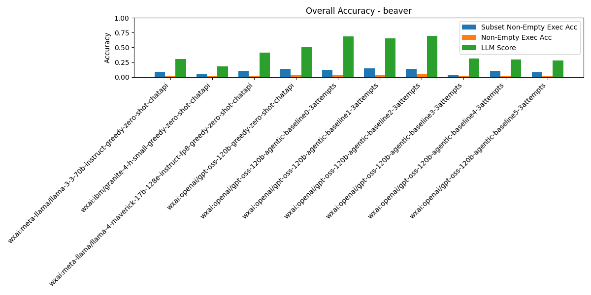
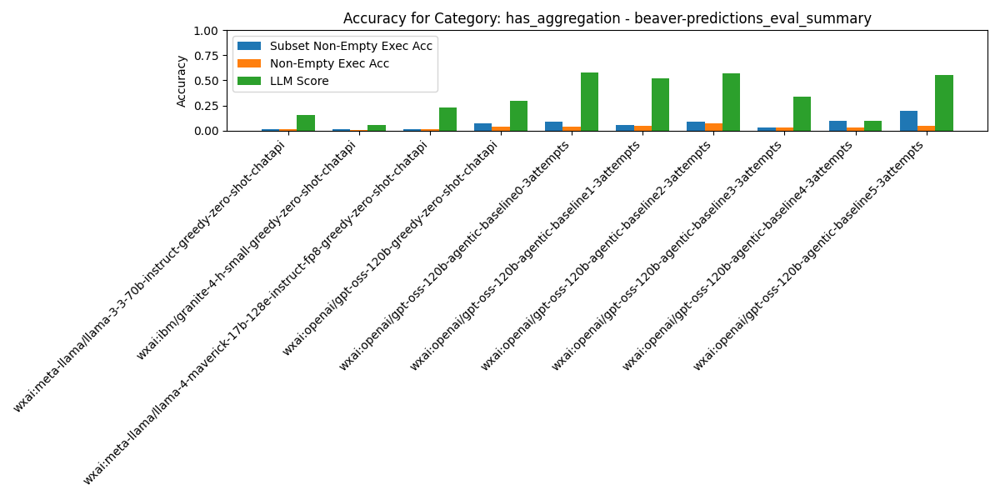
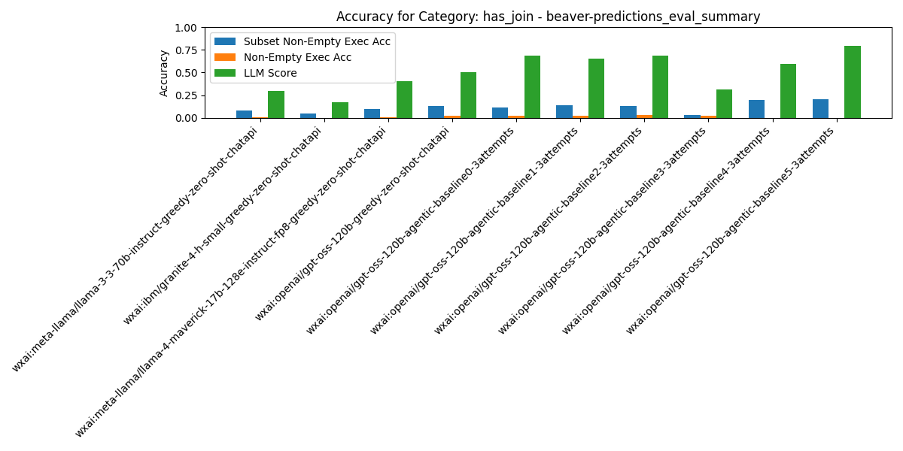
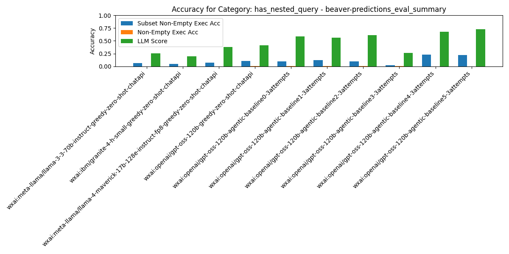
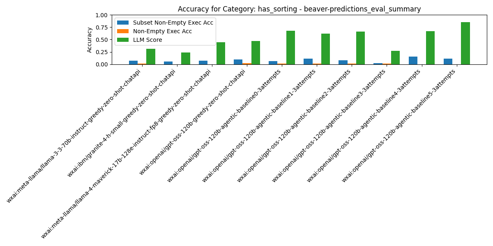
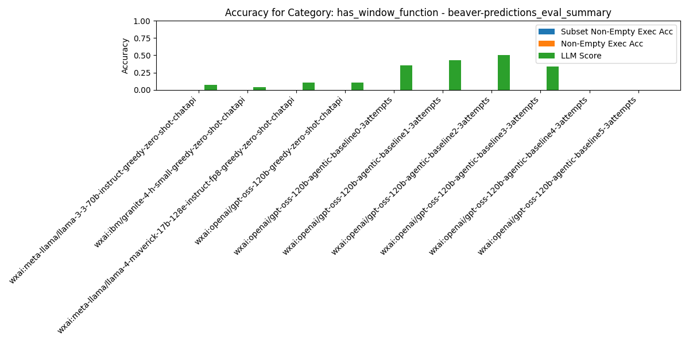
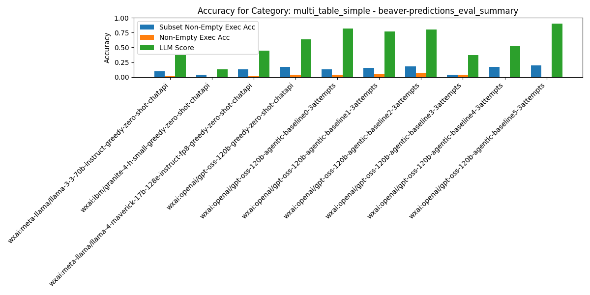
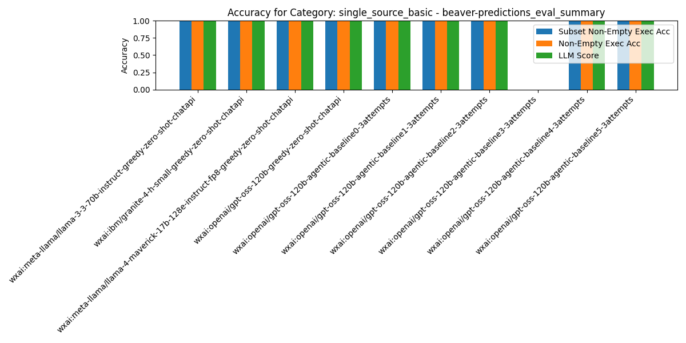

# Summary Results

## Overall Average Accuracy Results

| Rank | Pipeline | Records # | Predictions # | Exec Acc | Non-Empty Exec Acc | Subset Non-Empty Exec Acc | BIRD Exec Acc | Parsable SQL | Syntactic Equivalence Score | LLM Score |
| --- | --- | --- | --- | --- | --- | --- | --- | --- | --- | --- |
| 1 | wxai:openai/gpt-oss-120b-agentic-baseline5-3attempts | 209 | 0 | 0.03 | 0.03 | 0.23 | 0.03 | 1.00 | 0.00 | 0.80 |
| 2 | wxai:openai/gpt-oss-120b-agentic-baseline4-3attempts | 209 | 0 | 0.02 | 0.02 | 0.21 | 0.03 | 1.00 | 0.00 | 0.60 |
| 3 | wxai:openai/gpt-oss-120b-agentic-baseline1-3attempts | 209 | 0 | 0.04 | 0.03 | 0.14 | 0.06 | 0.99 | 0.01 | 0.66 |
| 4 | wxai:openai/gpt-oss-120b-greedy-zero-shot-chatapi | 209 | 0 | 0.03 | 0.03 | 0.14 | 0.06 | 0.98 | 0.00 | 0.51 |
| 5 | wxai:openai/gpt-oss-120b-agentic-baseline2-3attempts | 209 | 0 | 0.05 | 0.04 | 0.14 | 0.07 | 0.98 | 0.00 | 0.69 |
| 6 | wxai:openai/gpt-oss-120b-agentic-baseline0-3attempts | 209 | 0 | 0.03 | 0.03 | 0.12 | 0.06 | 1.00 | 0.00 | 0.69 |
| 7 | wxai:meta-llama/llama-4-maverick-17b-128e-instruct-fp8-greedy-zero-shot-chatapi | 209 | 0 | 0.02 | 0.01 | 0.11 | 0.04 | 1.00 | 0.00 | 0.41 |
| 8 | wxai:meta-llama/llama-3-3-70b-instruct-greedy-zero-shot-chatapi | 209 | 0 | 0.02 | 0.01 | 0.09 | 0.05 | 1.00 | 0.00 | 0.31 |
| 9 | wxai:ibm/granite-4-h-small-greedy-zero-shot-chatapi | 209 | 0 | 0.01 | 0.01 | 0.05 | 0.02 | 1.00 | 0.00 | 0.18 |
| 10 | wxai:openai/gpt-oss-120b-agentic-baseline3-3attempts | 209 | 0 | 0.02 | 0.02 | 0.03 | 0.03 | 0.96 | 0.00 | 0.31 |

## Category: `has_aggregation`

| Rank | Pipeline | Records # | Predictions # | Exec Acc | Non-Empty Exec Acc | Subset Non-Empty Exec Acc | BIRD Exec Acc | Parsable SQL | Syntactic Equivalence Score | LLM Score |
| --- | --- | --- | --- | --- | --- | --- | --- | --- | --- | --- |
| 1 | wxai:openai/gpt-oss-120b-agentic-baseline5-3attempts | 119 | 0 | 0.05 | 0.05 | 0.20 | 0.05 | 1.00 | 0.00 | 0.55 |
| 2 | wxai:openai/gpt-oss-120b-agentic-baseline4-3attempts | 119 | 0 | 0.03 | 0.03 | 0.10 | 0.03 | 1.00 | 0.00 | 0.10 |
| 3 | wxai:openai/gpt-oss-120b-agentic-baseline0-3attempts | 119 | 0 | 0.04 | 0.04 | 0.08 | 0.04 | 0.99 | 0.00 | 0.58 |
| 4 | wxai:openai/gpt-oss-120b-agentic-baseline2-3attempts | 119 | 0 | 0.07 | 0.07 | 0.08 | 0.06 | 0.97 | 0.01 | 0.57 |
| 5 | wxai:openai/gpt-oss-120b-greedy-zero-shot-chatapi | 119 | 0 | 0.04 | 0.04 | 0.07 | 0.04 | 0.97 | 0.00 | 0.29 |
| 6 | wxai:openai/gpt-oss-120b-agentic-baseline1-3attempts | 119 | 0 | 0.05 | 0.05 | 0.06 | 0.05 | 0.97 | 0.02 | 0.52 |
| 7 | wxai:openai/gpt-oss-120b-agentic-baseline3-3attempts | 119 | 0 | 0.03 | 0.03 | 0.03 | 0.03 | 0.94 | 0.00 | 0.34 |
| 8 | wxai:meta-llama/llama-3-3-70b-instruct-greedy-zero-shot-chatapi | 119 | 0 | 0.02 | 0.02 | 0.02 | 0.02 | 1.00 | 0.00 | 0.15 |
| 9 | wxai:ibm/granite-4-h-small-greedy-zero-shot-chatapi | 119 | 0 | 0.01 | 0.01 | 0.02 | 0.01 | 1.00 | 0.00 | 0.06 |
| 10 | wxai:meta-llama/llama-4-maverick-17b-128e-instruct-fp8-greedy-zero-shot-chatapi | 119 | 0 | 0.02 | 0.02 | 0.02 | 0.02 | 1.00 | 0.00 | 0.23 |

## Category: `has_join`

| Rank | Pipeline | Records # | Predictions # | Exec Acc | Non-Empty Exec Acc | Subset Non-Empty Exec Acc | BIRD Exec Acc | Parsable SQL | Syntactic Equivalence Score | LLM Score |
| --- | --- | --- | --- | --- | --- | --- | --- | --- | --- | --- |
| 1 | wxai:openai/gpt-oss-120b-agentic-baseline5-3attempts | 207 | 0 | 0.00 | 0.00 | 0.21 | 0.01 | 1.00 | 0.00 | 0.79 |
| 2 | wxai:openai/gpt-oss-120b-agentic-baseline4-3attempts | 207 | 0 | 0.00 | 0.00 | 0.20 | 0.02 | 1.00 | 0.00 | 0.59 |
| 3 | wxai:openai/gpt-oss-120b-agentic-baseline1-3attempts | 207 | 0 | 0.03 | 0.02 | 0.14 | 0.06 | 0.99 | 0.01 | 0.65 |
| 4 | wxai:openai/gpt-oss-120b-greedy-zero-shot-chatapi | 207 | 0 | 0.02 | 0.02 | 0.13 | 0.05 | 0.98 | 0.00 | 0.50 |
| 5 | wxai:openai/gpt-oss-120b-agentic-baseline2-3attempts | 207 | 0 | 0.04 | 0.03 | 0.13 | 0.07 | 0.98 | 0.00 | 0.69 |
| 6 | wxai:openai/gpt-oss-120b-agentic-baseline0-3attempts | 207 | 0 | 0.02 | 0.02 | 0.11 | 0.05 | 1.00 | 0.00 | 0.69 |
| 7 | wxai:meta-llama/llama-4-maverick-17b-128e-instruct-fp8-greedy-zero-shot-chatapi | 207 | 0 | 0.01 | 0.00 | 0.10 | 0.03 | 1.00 | 0.00 | 0.41 |
| 8 | wxai:meta-llama/llama-3-3-70b-instruct-greedy-zero-shot-chatapi | 207 | 0 | 0.01 | 0.00 | 0.08 | 0.04 | 1.00 | 0.00 | 0.30 |
| 9 | wxai:ibm/granite-4-h-small-greedy-zero-shot-chatapi | 207 | 0 | 0.00 | 0.00 | 0.04 | 0.01 | 1.00 | 0.00 | 0.17 |
| 10 | wxai:openai/gpt-oss-120b-agentic-baseline3-3attempts | 207 | 0 | 0.02 | 0.02 | 0.03 | 0.03 | 0.96 | 0.00 | 0.32 |

## Category: `has_nested_query`

| Rank | Pipeline | Records # | Predictions # | Exec Acc | Non-Empty Exec Acc | Subset Non-Empty Exec Acc | BIRD Exec Acc | Parsable SQL | Syntactic Equivalence Score | LLM Score |
| --- | --- | --- | --- | --- | --- | --- | --- | --- | --- | --- |
| 1 | wxai:openai/gpt-oss-120b-agentic-baseline4-3attempts | 121 | 0 | 0.00 | 0.00 | 0.23 | 0.04 | 1.00 | 0.00 | 0.68 |
| 2 | wxai:openai/gpt-oss-120b-agentic-baseline5-3attempts | 121 | 0 | 0.00 | 0.00 | 0.22 | 0.00 | 1.00 | 0.00 | 0.73 |
| 3 | wxai:openai/gpt-oss-120b-agentic-baseline1-3attempts | 121 | 0 | 0.01 | 0.01 | 0.12 | 0.05 | 0.98 | 0.00 | 0.56 |
| 4 | wxai:openai/gpt-oss-120b-greedy-zero-shot-chatapi | 121 | 0 | 0.01 | 0.01 | 0.11 | 0.05 | 0.97 | 0.00 | 0.41 |
| 5 | wxai:openai/gpt-oss-120b-agentic-baseline0-3attempts | 121 | 0 | 0.01 | 0.01 | 0.10 | 0.04 | 0.99 | 0.00 | 0.59 |
| 6 | wxai:openai/gpt-oss-120b-agentic-baseline2-3attempts | 121 | 0 | 0.01 | 0.01 | 0.10 | 0.05 | 0.97 | 0.00 | 0.61 |
| 7 | wxai:meta-llama/llama-4-maverick-17b-128e-instruct-fp8-greedy-zero-shot-chatapi | 121 | 0 | 0.00 | 0.00 | 0.07 | 0.03 | 1.00 | 0.00 | 0.38 |
| 8 | wxai:meta-llama/llama-3-3-70b-instruct-greedy-zero-shot-chatapi | 121 | 0 | 0.00 | 0.00 | 0.07 | 0.03 | 1.00 | 0.00 | 0.26 |
| 9 | wxai:ibm/granite-4-h-small-greedy-zero-shot-chatapi | 121 | 0 | 0.00 | 0.00 | 0.05 | 0.02 | 1.00 | 0.00 | 0.20 |
| 10 | wxai:openai/gpt-oss-120b-agentic-baseline3-3attempts | 121 | 0 | 0.01 | 0.01 | 0.03 | 0.02 | 0.93 | 0.00 | 0.27 |

## Category: `has_sorting`

| Rank | Pipeline | Records # | Predictions # | Exec Acc | Non-Empty Exec Acc | Subset Non-Empty Exec Acc | BIRD Exec Acc | Parsable SQL | Syntactic Equivalence Score | LLM Score |
| --- | --- | --- | --- | --- | --- | --- | --- | --- | --- | --- |
| 1 | wxai:openai/gpt-oss-120b-agentic-baseline4-3attempts | 97 | 0 | 0.00 | 0.00 | 0.16 | 0.04 | 1.00 | 0.00 | 0.67 |
| 2 | wxai:openai/gpt-oss-120b-agentic-baseline5-3attempts | 97 | 0 | 0.00 | 0.00 | 0.11 | 0.00 | 1.00 | 0.00 | 0.86 |
| 3 | wxai:openai/gpt-oss-120b-agentic-baseline1-3attempts | 97 | 0 | 0.01 | 0.01 | 0.11 | 0.03 | 0.99 | 0.02 | 0.62 |
| 4 | wxai:openai/gpt-oss-120b-greedy-zero-shot-chatapi | 97 | 0 | 0.02 | 0.02 | 0.09 | 0.04 | 0.97 | 0.00 | 0.47 |
| 5 | wxai:openai/gpt-oss-120b-agentic-baseline2-3attempts | 97 | 0 | 0.01 | 0.01 | 0.08 | 0.03 | 0.97 | 0.00 | 0.66 |
| 6 | wxai:meta-llama/llama-3-3-70b-instruct-greedy-zero-shot-chatapi | 97 | 0 | 0.01 | 0.01 | 0.07 | 0.04 | 1.00 | 0.00 | 0.31 |
| 7 | wxai:meta-llama/llama-4-maverick-17b-128e-instruct-fp8-greedy-zero-shot-chatapi | 97 | 0 | 0.00 | 0.00 | 0.07 | 0.02 | 1.00 | 0.00 | 0.44 |
| 8 | wxai:openai/gpt-oss-120b-agentic-baseline0-3attempts | 97 | 0 | 0.01 | 0.01 | 0.06 | 0.03 | 1.00 | 0.00 | 0.68 |
| 9 | wxai:ibm/granite-4-h-small-greedy-zero-shot-chatapi | 97 | 0 | 0.00 | 0.00 | 0.05 | 0.01 | 1.00 | 0.00 | 0.24 |
| 10 | wxai:openai/gpt-oss-120b-agentic-baseline3-3attempts | 97 | 0 | 0.01 | 0.01 | 0.02 | 0.01 | 0.96 | 0.00 | 0.27 |

## Category: `has_window_function`

| Rank | Pipeline | Records # | Predictions # | Exec Acc | Non-Empty Exec Acc | Subset Non-Empty Exec Acc | BIRD Exec Acc | Parsable SQL | Syntactic Equivalence Score | LLM Score |
| --- | --- | --- | --- | --- | --- | --- | --- | --- | --- | --- |
| 1 | wxai:meta-llama/llama-3-3-70b-instruct-greedy-zero-shot-chatapi | 28 | 0 | 0.00 | 0.00 | 0.00 | 0.00 | 1.00 | 0.00 | 0.07 |
| 2 | wxai:ibm/granite-4-h-small-greedy-zero-shot-chatapi | 28 | 0 | 0.00 | 0.00 | 0.00 | 0.00 | 1.00 | 0.00 | 0.04 |
| 3 | wxai:meta-llama/llama-4-maverick-17b-128e-instruct-fp8-greedy-zero-shot-chatapi | 28 | 0 | 0.00 | 0.00 | 0.00 | 0.00 | 1.00 | 0.00 | 0.11 |
| 4 | wxai:openai/gpt-oss-120b-greedy-zero-shot-chatapi | 28 | 0 | 0.00 | 0.00 | 0.00 | 0.00 | 0.96 | 0.00 | 0.11 |
| 5 | wxai:openai/gpt-oss-120b-agentic-baseline0-3attempts | 28 | 0 | 0.00 | 0.00 | 0.00 | 0.00 | 1.00 | 0.00 | 0.36 |
| 6 | wxai:openai/gpt-oss-120b-agentic-baseline1-3attempts | 28 | 0 | 0.00 | 0.00 | 0.00 | 0.00 | 1.00 | 0.04 | 0.43 |
| 7 | wxai:openai/gpt-oss-120b-agentic-baseline2-3attempts | 28 | 0 | 0.00 | 0.00 | 0.00 | 0.00 | 0.93 | 0.00 | 0.50 |
| 8 | wxai:openai/gpt-oss-120b-agentic-baseline3-3attempts | 28 | 0 | 0.00 | 0.00 | 0.00 | 0.00 | 0.89 | 0.00 | 0.33 |
| 9 | wxai:openai/gpt-oss-120b-agentic-baseline4-3attempts | 28 | 0 | 0.00 | 0.00 | 0.00 | 0.00 | 1.00 | 0.00 | 0.00 |
| 10 | wxai:openai/gpt-oss-120b-agentic-baseline5-3attempts | 28 | 0 | 0.00 | 0.00 | 0.00 | 0.00 | 1.00 | 0.00 | 0.00 |

## Category: `multi_table_simple`

| Rank | Pipeline | Records # | Predictions # | Exec Acc | Non-Empty Exec Acc | Subset Non-Empty Exec Acc | BIRD Exec Acc | Parsable SQL | Syntactic Equivalence Score | LLM Score |
| --- | --- | --- | --- | --- | --- | --- | --- | --- | --- | --- |
| 1 | wxai:openai/gpt-oss-120b-agentic-baseline5-3attempts | 83 | 0 | 0.00 | 0.00 | 0.20 | 0.03 | 1.00 | 0.00 | 0.90 |
| 2 | wxai:openai/gpt-oss-120b-agentic-baseline2-3attempts | 83 | 0 | 0.10 | 0.07 | 0.18 | 0.10 | 1.00 | 0.01 | 0.81 |
| 3 | wxai:openai/gpt-oss-120b-agentic-baseline4-3attempts | 83 | 0 | 0.00 | 0.00 | 0.17 | 0.00 | 1.00 | 0.00 | 0.52 |
| 4 | wxai:openai/gpt-oss-120b-greedy-zero-shot-chatapi | 83 | 0 | 0.05 | 0.04 | 0.17 | 0.06 | 1.00 | 0.00 | 0.64 |
| 5 | wxai:openai/gpt-oss-120b-agentic-baseline1-3attempts | 83 | 0 | 0.06 | 0.05 | 0.16 | 0.07 | 0.99 | 0.01 | 0.77 |
| 6 | wxai:meta-llama/llama-4-maverick-17b-128e-instruct-fp8-greedy-zero-shot-chatapi | 83 | 0 | 0.02 | 0.01 | 0.13 | 0.04 | 1.00 | 0.00 | 0.45 |
| 7 | wxai:openai/gpt-oss-120b-agentic-baseline0-3attempts | 83 | 0 | 0.05 | 0.04 | 0.13 | 0.07 | 1.00 | 0.00 | 0.82 |
| 8 | wxai:meta-llama/llama-3-3-70b-instruct-greedy-zero-shot-chatapi | 83 | 0 | 0.02 | 0.01 | 0.10 | 0.06 | 1.00 | 0.00 | 0.37 |
| 9 | wxai:ibm/granite-4-h-small-greedy-zero-shot-chatapi | 83 | 0 | 0.00 | 0.00 | 0.04 | 0.01 | 1.00 | 0.00 | 0.13 |
| 10 | wxai:openai/gpt-oss-120b-agentic-baseline3-3attempts | 83 | 0 | 0.05 | 0.04 | 0.04 | 0.05 | 0.99 | 0.00 | 0.37 |

## Category: `single_source_basic`

| Rank | Pipeline | Records # | Predictions # | Exec Acc | Non-Empty Exec Acc | Subset Non-Empty Exec Acc | BIRD Exec Acc | Parsable SQL | Syntactic Equivalence Score | LLM Score |
| --- | --- | --- | --- | --- | --- | --- | --- | --- | --- | --- |
| 1 | wxai:meta-llama/llama-3-3-70b-instruct-greedy-zero-shot-chatapi | 2 | 0 | 1.00 | 1.00 | 1.00 | 0.50 | 1.00 | 0.00 | 1.00 |
| 2 | wxai:ibm/granite-4-h-small-greedy-zero-shot-chatapi | 2 | 0 | 1.00 | 1.00 | 1.00 | 0.50 | 1.00 | 0.00 | 1.00 |
| 3 | wxai:meta-llama/llama-4-maverick-17b-128e-instruct-fp8-greedy-zero-shot-chatapi | 2 | 0 | 1.00 | 1.00 | 1.00 | 0.50 | 1.00 | 0.00 | 1.00 |
| 4 | wxai:openai/gpt-oss-120b-greedy-zero-shot-chatapi | 2 | 0 | 1.00 | 1.00 | 1.00 | 0.50 | 1.00 | 0.00 | 1.00 |
| 5 | wxai:openai/gpt-oss-120b-agentic-baseline0-3attempts | 2 | 0 | 1.00 | 1.00 | 1.00 | 0.50 | 1.00 | 0.00 | 1.00 |
| 6 | wxai:openai/gpt-oss-120b-agentic-baseline1-3attempts | 2 | 0 | 1.00 | 1.00 | 1.00 | 0.50 | 1.00 | 0.00 | 1.00 |
| 7 | wxai:openai/gpt-oss-120b-agentic-baseline2-3attempts | 2 | 0 | 1.00 | 1.00 | 1.00 | 0.50 | 1.00 | 0.00 | 1.00 |
| 8 | wxai:openai/gpt-oss-120b-agentic-baseline4-3attempts | 2 | 0 | 1.00 | 1.00 | 1.00 | 0.50 | 1.00 | 0.00 | 1.00 |
| 9 | wxai:openai/gpt-oss-120b-agentic-baseline5-3attempts | 2 | 0 | 1.00 | 1.00 | 1.00 | 0.50 | 1.00 | 0.00 | 1.00 |
| 10 | wxai:openai/gpt-oss-120b-agentic-baseline3-3attempts | 2 | 0 | 0.00 | 0.00 | 0.00 | 0.00 | 1.00 | 0.00 | 0.00 |

# Per-Pipeline Comparison Across Categories

### Pipeline: `wxai:ibm/granite-4-h-small-greedy-zero-shot-chatapi`
| Category | # Records | # Predictions | Exec Acc | Non-Empty Exec Acc | Subset Non-Empty Exec Acc | BIRD Exec Acc | LLM Score |
|---|---|---|---|---|---|---|---|
| All Categories | 209 | 0 | 0.010 | 0.010 | 0.053 | 0.019 | 0.177 |
| has_aggregation | 119 | 0 | 0.008 | 0.008 | 0.017 | 0.008 | 0.059 |
| has_join | 207 | 0 | 0.000 | 0.000 | 0.043 | 0.014 | 0.169 |
| has_nested_query | 121 | 0 | 0.000 | 0.000 | 0.050 | 0.017 | 0.198 |
| has_sorting | 97 | 0 | 0.000 | 0.000 | 0.052 | 0.010 | 0.237 |
| has_window_function | 28 | 0 | 0.000 | 0.000 | 0.000 | 0.000 | 0.036 |
| multi_table_simple | 83 | 0 | 0.000 | 0.000 | 0.036 | 0.012 | 0.133 |
| single_source_basic | 2 | 0 | 1.000 | 1.000 | 1.000 | 0.500 | 1.000 |

### Pipeline: `wxai:meta-llama/llama-3-3-70b-instruct-greedy-zero-shot-chatapi`
| Category | # Records | # Predictions | Exec Acc | Non-Empty Exec Acc | Subset Non-Empty Exec Acc | BIRD Exec Acc | LLM Score |
|---|---|---|---|---|---|---|---|
| All Categories | 209 | 0 | 0.019 | 0.014 | 0.086 | 0.048 | 0.306 |
| has_aggregation | 119 | 0 | 0.017 | 0.017 | 0.017 | 0.017 | 0.151 |
| has_join | 207 | 0 | 0.010 | 0.005 | 0.077 | 0.043 | 0.300 |
| has_nested_query | 121 | 0 | 0.000 | 0.000 | 0.066 | 0.033 | 0.256 |
| has_sorting | 97 | 0 | 0.010 | 0.010 | 0.072 | 0.041 | 0.309 |
| has_window_function | 28 | 0 | 0.000 | 0.000 | 0.000 | 0.000 | 0.071 |
| multi_table_simple | 83 | 0 | 0.024 | 0.012 | 0.096 | 0.060 | 0.373 |
| single_source_basic | 2 | 0 | 1.000 | 1.000 | 1.000 | 0.500 | 1.000 |

### Pipeline: `wxai:meta-llama/llama-4-maverick-17b-128e-instruct-fp8-greedy-zero-shot-chatapi`
| Category | # Records | # Predictions | Exec Acc | Non-Empty Exec Acc | Subset Non-Empty Exec Acc | BIRD Exec Acc | LLM Score |
|---|---|---|---|---|---|---|---|
| All Categories | 209 | 0 | 0.019 | 0.014 | 0.105 | 0.038 | 0.411 |
| has_aggregation | 119 | 0 | 0.017 | 0.017 | 0.017 | 0.017 | 0.227 |
| has_join | 207 | 0 | 0.010 | 0.005 | 0.097 | 0.034 | 0.406 |
| has_nested_query | 121 | 0 | 0.000 | 0.000 | 0.074 | 0.033 | 0.380 |
| has_sorting | 97 | 0 | 0.000 | 0.000 | 0.072 | 0.021 | 0.443 |
| has_window_function | 28 | 0 | 0.000 | 0.000 | 0.000 | 0.000 | 0.107 |
| multi_table_simple | 83 | 0 | 0.024 | 0.012 | 0.133 | 0.036 | 0.446 |
| single_source_basic | 2 | 0 | 1.000 | 1.000 | 1.000 | 0.500 | 1.000 |

### Pipeline: `wxai:openai/gpt-oss-120b-agentic-baseline0-3attempts`
| Category | # Records | # Predictions | Exec Acc | Non-Empty Exec Acc | Subset Non-Empty Exec Acc | BIRD Exec Acc | LLM Score |
|---|---|---|---|---|---|---|---|
| All Categories | 209 | 0 | 0.033 | 0.029 | 0.120 | 0.057 | 0.689 |
| has_aggregation | 119 | 0 | 0.042 | 0.042 | 0.084 | 0.042 | 0.580 |
| has_join | 207 | 0 | 0.024 | 0.019 | 0.111 | 0.053 | 0.686 |
| has_nested_query | 121 | 0 | 0.008 | 0.008 | 0.099 | 0.041 | 0.587 |
| has_sorting | 97 | 0 | 0.010 | 0.010 | 0.062 | 0.031 | 0.680 |
| has_window_function | 28 | 0 | 0.000 | 0.000 | 0.000 | 0.000 | 0.357 |
| multi_table_simple | 83 | 0 | 0.048 | 0.036 | 0.133 | 0.072 | 0.819 |
| single_source_basic | 2 | 0 | 1.000 | 1.000 | 1.000 | 0.500 | 1.000 |

### Pipeline: `wxai:openai/gpt-oss-120b-agentic-baseline1-3attempts`
| Category | # Records | # Predictions | Exec Acc | Non-Empty Exec Acc | Subset Non-Empty Exec Acc | BIRD Exec Acc | LLM Score |
|---|---|---|---|---|---|---|---|
| All Categories | 209 | 0 | 0.038 | 0.033 | 0.144 | 0.062 | 0.656 |
| has_aggregation | 119 | 0 | 0.050 | 0.050 | 0.059 | 0.050 | 0.521 |
| has_join | 207 | 0 | 0.029 | 0.024 | 0.135 | 0.058 | 0.652 |
| has_nested_query | 121 | 0 | 0.008 | 0.008 | 0.124 | 0.050 | 0.562 |
| has_sorting | 97 | 0 | 0.010 | 0.010 | 0.113 | 0.031 | 0.619 |
| has_window_function | 28 | 0 | 0.000 | 0.000 | 0.000 | 0.000 | 0.429 |
| multi_table_simple | 83 | 0 | 0.060 | 0.048 | 0.157 | 0.072 | 0.771 |
| single_source_basic | 2 | 0 | 1.000 | 1.000 | 1.000 | 0.500 | 1.000 |

### Pipeline: `wxai:openai/gpt-oss-120b-agentic-baseline2-3attempts`
| Category | # Records | # Predictions | Exec Acc | Non-Empty Exec Acc | Subset Non-Empty Exec Acc | BIRD Exec Acc | LLM Score |
|---|---|---|---|---|---|---|---|
| All Categories | 209 | 0 | 0.053 | 0.043 | 0.139 | 0.072 | 0.694 |
| has_aggregation | 119 | 0 | 0.067 | 0.067 | 0.084 | 0.059 | 0.571 |
| has_join | 207 | 0 | 0.043 | 0.034 | 0.130 | 0.068 | 0.691 |
| has_nested_query | 121 | 0 | 0.008 | 0.008 | 0.099 | 0.050 | 0.612 |
| has_sorting | 97 | 0 | 0.010 | 0.010 | 0.082 | 0.031 | 0.660 |
| has_window_function | 28 | 0 | 0.000 | 0.000 | 0.000 | 0.000 | 0.500 |
| multi_table_simple | 83 | 0 | 0.096 | 0.072 | 0.181 | 0.096 | 0.807 |
| single_source_basic | 2 | 0 | 1.000 | 1.000 | 1.000 | 0.500 | 1.000 |

### Pipeline: `wxai:openai/gpt-oss-120b-agentic-baseline3-3attempts`
| Category | # Records | # Predictions | Exec Acc | Non-Empty Exec Acc | Subset Non-Empty Exec Acc | BIRD Exec Acc | LLM Score |
|---|---|---|---|---|---|---|---|
| All Categories | 209 | 0 | 0.024 | 0.019 | 0.029 | 0.029 | 0.312 |
| has_aggregation | 119 | 0 | 0.034 | 0.034 | 0.034 | 0.025 | 0.339 |
| has_join | 207 | 0 | 0.024 | 0.019 | 0.029 | 0.029 | 0.316 |
| has_nested_query | 121 | 0 | 0.008 | 0.008 | 0.025 | 0.017 | 0.267 |
| has_sorting | 97 | 0 | 0.010 | 0.010 | 0.021 | 0.010 | 0.271 |
| has_window_function | 28 | 0 | 0.000 | 0.000 | 0.000 | 0.000 | 0.333 |
| multi_table_simple | 83 | 0 | 0.048 | 0.036 | 0.036 | 0.048 | 0.373 |
| single_source_basic | 2 | 0 | 0.000 | 0.000 | 0.000 | 0.000 | 0.000 |

### Pipeline: `wxai:openai/gpt-oss-120b-agentic-baseline4-3attempts`
| Category | # Records | # Predictions | Exec Acc | Non-Empty Exec Acc | Subset Non-Empty Exec Acc | BIRD Exec Acc | LLM Score |
|---|---|---|---|---|---|---|---|
| All Categories | 209 | 0 | 0.019 | 0.019 | 0.214 | 0.029 | 0.602 |
| has_aggregation | 119 | 0 | 0.033 | 0.033 | 0.100 | 0.033 | 0.100 |
| has_join | 207 | 0 | 0.000 | 0.000 | 0.198 | 0.020 | 0.594 |
| has_nested_query | 121 | 0 | 0.000 | 0.000 | 0.226 | 0.038 | 0.679 |
| has_sorting | 97 | 0 | 0.000 | 0.000 | 0.156 | 0.044 | 0.667 |
| has_window_function | 28 | 0 | 0.000 | 0.000 | 0.000 | 0.000 | 0.000 |
| multi_table_simple | 83 | 0 | 0.000 | 0.000 | 0.174 | 0.000 | 0.522 |
| single_source_basic | 2 | 0 | 1.000 | 1.000 | 1.000 | 0.500 | 1.000 |

### Pipeline: `wxai:openai/gpt-oss-120b-agentic-baseline5-3attempts`
| Category | # Records | # Predictions | Exec Acc | Non-Empty Exec Acc | Subset Non-Empty Exec Acc | BIRD Exec Acc | LLM Score |
|---|---|---|---|---|---|---|---|
| All Categories | 209 | 0 | 0.027 | 0.027 | 0.230 | 0.027 | 0.797 |
| has_aggregation | 119 | 0 | 0.050 | 0.050 | 0.200 | 0.050 | 0.550 |
| has_join | 207 | 0 | 0.000 | 0.000 | 0.208 | 0.014 | 0.792 |
| has_nested_query | 121 | 0 | 0.000 | 0.000 | 0.220 | 0.000 | 0.732 |
| has_sorting | 97 | 0 | 0.000 | 0.000 | 0.114 | 0.000 | 0.857 |
| has_window_function | 28 | 0 | 0.000 | 0.000 | 0.000 | 0.000 | 0.000 |
| multi_table_simple | 83 | 0 | 0.000 | 0.000 | 0.200 | 0.033 | 0.900 |
| single_source_basic | 2 | 0 | 1.000 | 1.000 | 1.000 | 0.500 | 1.000 |

### Pipeline: `wxai:openai/gpt-oss-120b-greedy-zero-shot-chatapi`
| Category | # Records | # Predictions | Exec Acc | Non-Empty Exec Acc | Subset Non-Empty Exec Acc | BIRD Exec Acc | LLM Score |
|---|---|---|---|---|---|---|---|
| All Categories | 209 | 0 | 0.033 | 0.029 | 0.139 | 0.057 | 0.507 |
| has_aggregation | 119 | 0 | 0.042 | 0.042 | 0.067 | 0.042 | 0.294 |
| has_join | 207 | 0 | 0.024 | 0.019 | 0.130 | 0.053 | 0.502 |
| has_nested_query | 121 | 0 | 0.008 | 0.008 | 0.107 | 0.050 | 0.413 |
| has_sorting | 97 | 0 | 0.021 | 0.021 | 0.093 | 0.041 | 0.474 |
| has_window_function | 28 | 0 | 0.000 | 0.000 | 0.000 | 0.000 | 0.107 |
| multi_table_simple | 83 | 0 | 0.048 | 0.036 | 0.169 | 0.060 | 0.639 |
| single_source_basic | 2 | 0 | 1.000 | 1.000 | 1.000 | 0.500 | 1.000 |