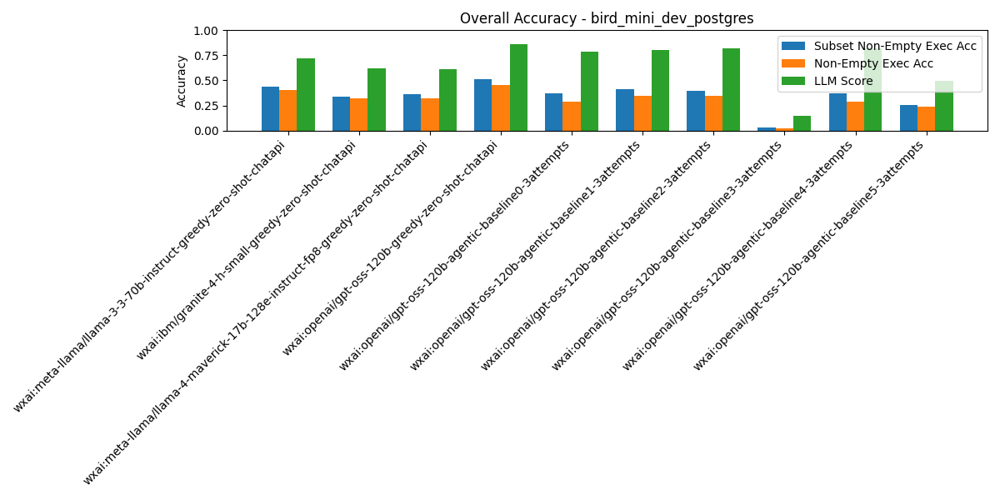

# Summary Results

## Overall Average Accuracy Results

| Rank | Pipeline | Records # | Predictions # | Exec Acc | Non-Empty Exec Acc | Subset Non-Empty Exec Acc | BIRD Exec Acc | Parsable SQL | Syntactic Equivalence Score | LLM Score |
| --- | --- | --- | --- | --- | --- | --- | --- | --- | --- | --- |
| 1 | wxai:openai/gpt-oss-120b-greedy-zero-shot-chatapi | 500 | 0 | 0.45 | 0.45 | 0.51 | 0.47 | 1.00 | 0.04 | 0.87 |
| 2 | wxai:meta-llama/llama-3-3-70b-instruct-greedy-zero-shot-chatapi | 500 | 0 | 0.41 | 0.41 | 0.44 | 0.43 | 1.00 | 0.06 | 0.72 |
| 3 | wxai:openai/gpt-oss-120b-agentic-baseline1-3attempts | 500 | 0 | 0.35 | 0.35 | 0.41 | 0.38 | 1.00 | 0.04 | 0.80 |
| 4 | wxai:openai/gpt-oss-120b-agentic-baseline2-3attempts | 500 | 0 | 0.35 | 0.34 | 0.39 | 0.38 | 1.00 | 0.02 | 0.82 |
| 5 | wxai:openai/gpt-oss-120b-agentic-baseline4-3attempts | 500 | 0 | 0.31 | 0.31 | 0.39 | 0.33 | 1.00 | 0.04 | 0.86 |
| 6 | wxai:openai/gpt-oss-120b-agentic-baseline0-3attempts | 500 | 0 | 0.29 | 0.29 | 0.37 | 0.32 | 1.00 | 0.02 | 0.79 |
| 7 | wxai:meta-llama/llama-4-maverick-17b-128e-instruct-fp8-greedy-zero-shot-chatapi | 500 | 0 | 0.33 | 0.32 | 0.37 | 0.35 | 1.00 | 0.08 | 0.62 |
| 8 | wxai:ibm/granite-4-h-small-greedy-zero-shot-chatapi | 500 | 0 | 0.32 | 0.32 | 0.34 | 0.34 | 1.00 | 0.05 | 0.62 |
| 9 | wxai:openai/gpt-oss-120b-agentic-baseline5-3attempts | 500 | 0 | 0.32 | 0.32 | 0.34 | 0.34 | 1.00 | 0.04 | 0.66 |
| 10 | wxai:openai/gpt-oss-120b-agentic-baseline3-3attempts | 500 | 0 | 0.02 | 0.02 | 0.03 | 0.04 | 0.98 | 0.03 | 0.15 |

# Per-Pipeline Comparison Across Categories
