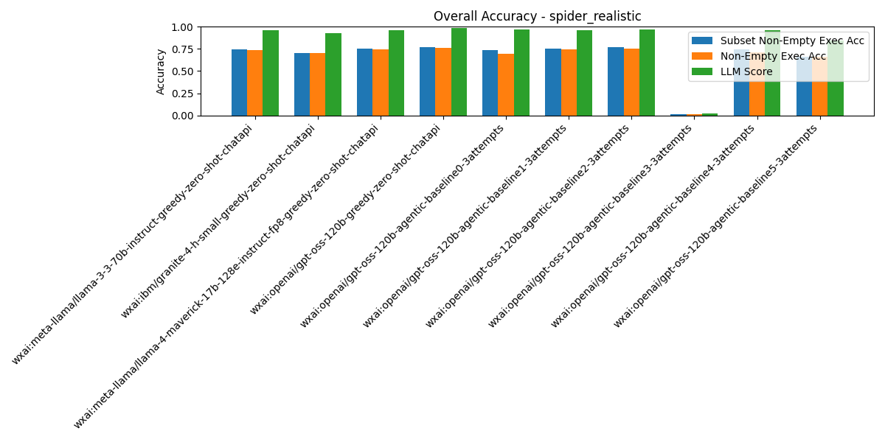

# Summary Results

## Overall Average Accuracy Results

| Rank | Pipeline | Records # | Predictions # | Exec Acc | Non-Empty Exec Acc | Subset Non-Empty Exec Acc | BIRD Exec Acc | Parsable SQL | Syntactic Equivalence Score | LLM Score |
| --- | --- | --- | --- | --- | --- | --- | --- | --- | --- | --- |
| 1 | wxai:openai/gpt-oss-120b-greedy-zero-shot-chatapi | 508 | 0 | 0.81 | 0.76 | 0.77 | 0.80 | 1.00 | 0.20 | 0.99 |
| 2 | wxai:openai/gpt-oss-120b-agentic-baseline2-3attempts | 508 | 0 | 0.81 | 0.76 | 0.77 | 0.79 | 1.00 | 0.21 | 0.97 |
| 3 | wxai:openai/gpt-oss-120b-agentic-baseline1-3attempts | 508 | 0 | 0.79 | 0.74 | 0.76 | 0.79 | 1.00 | 0.21 | 0.96 |
| 4 | wxai:meta-llama/llama-4-maverick-17b-128e-instruct-fp8-greedy-zero-shot-chatapi | 508 | 0 | 0.80 | 0.74 | 0.75 | 0.79 | 1.00 | 0.21 | 0.96 |
| 5 | wxai:openai/gpt-oss-120b-agentic-baseline4-3attempts | 508 | 0 | 0.73 | 0.71 | 0.75 | 0.71 | 1.00 | 0.19 | 0.96 |
| 6 | wxai:meta-llama/llama-3-3-70b-instruct-greedy-zero-shot-chatapi | 508 | 0 | 0.80 | 0.74 | 0.75 | 0.78 | 1.00 | 0.24 | 0.96 |
| 7 | wxai:openai/gpt-oss-120b-agentic-baseline0-3attempts | 508 | 0 | 0.75 | 0.70 | 0.74 | 0.74 | 1.00 | 0.15 | 0.97 |
| 8 | wxai:ibm/granite-4-h-small-greedy-zero-shot-chatapi | 508 | 0 | 0.75 | 0.70 | 0.71 | 0.74 | 1.00 | 0.21 | 0.93 |
| 9 | wxai:openai/gpt-oss-120b-agentic-baseline5-3attempts | 508 | 0 | 0.71 | 0.70 | 0.70 | 0.70 | 1.00 | 0.19 | 0.89 |
| 10 | wxai:openai/gpt-oss-120b-agentic-baseline3-3attempts | 508 | 0 | 0.02 | 0.02 | 0.02 | 0.02 | 1.00 | 0.18 | 0.03 |

# Per-Pipeline Comparison Across Categories
